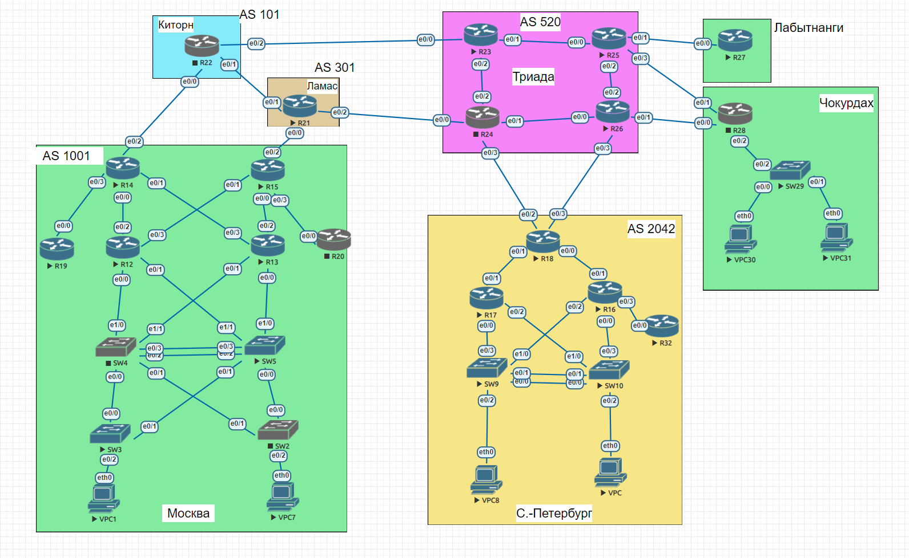

# Проектирование сети

## Цель:
В данной самостоятельной работе необходимо распланировать адресное пространство
Настроить IP на всех активных портах для дальнейшей работы над проектом
Адресное пространство должно быть задокументировано

## Описание/Пошаговая инструкция выполнения домашнего задания:
В этой самостоятельной работе мы ожидаем, что вы самостоятельно:

1. Разработаете и задокументируете адресное пространство для лабораторного стенда.
2. Настроите ip адреса на каждом активном порту
3. Настроите каждый VPC в каждом офисе в своем VLAN.
4. Настроите VLAN/Loopbackup interface управления для сетевых устройств
5. Настроите сети офисов так, чтобы не возникало broadcast штормов, а использование линков было максимально оптимизировано


### 1. Разработаете и задокументируете адресное пространство для лабораторного стенда.
Топология сети:



  Таблица сетевых адресов


| Location | Device | Interface | IP Address   | Subnet Mask     |Default Gateway|
|-------   |------- |------     |---------     |---------------- |---------------|
|  Москва  |        |           |              |                 |               |
|          |R14     |e0/0       |192.168.14.1 |255.255.255.252    |N/A            |
|          |        |e0/1       |192.168.14.5 |255.255.255.252  |N/A            |
|          |        |e0/2       |192.168.101.1 |255.255.255.252    |N/A            |
|          |        |e0/3       |192.168.14.9 |255.255.255.252    |N/A            |
|          |R15     |e0/0       |192.168.14.13 |255.255.255.252    |N/A            |
|          |        |e0/1       |192.168.14.17 |255.255.255.252  |N/A            |
|          |        |e0/2       |192.168.111.2 |255.255.255.252    |N/A            |
|          |        |e0/3       |192.168.14.21 |255.255.255.252    |N/A            |
|          |R19     |e0/0       |192.168.14.10 |255.255.255.252    |N/A            |
|          |R20     |e0/0       |192.168.14.22 |255.255.255.252    |N/A            |
|          |R12     |e0/0       |192.168.14.25 |255.255.255.252    |N/A            |
|          |        |e0/1       |192.168.14.29 |255.255.255.252  |N/A            |
|          |        |e0/2       |192.168.14.2 |255.255.255.252    |N/A            |
|          |        |e0/3       |192.168.14.18 |255.255.255.252    |N/A            |
|          |R13     |e0/0       |192.168.14.33 |255.255.255.252    |N/A            |
|          |        |e0/1       |192.168.14.37 |255.255.255.252  |N/A            |
|          |        |e0/2       |192.168.14.14 |255.255.255.252    |N/A            |
|          |        |e0/3       |192.168.14.6 |255.255.255.252    |N/A            |
|          |SW4    |VLAN 100    |10.0.100.4   |   255.255.255.248  | 	N/A		     |
|          |SW5    |VLAN 100    |10.0.100.3   |   255.255.255.248  | 	N/A		     |
|          |SW3    |VLAN 100    |10.0.100.1   |   255.255.255.248    | 	N/A		     |
|          |SW2    |VLAN 100   |10.0.100.2   |   255.255.255.248   | 	N/A		     |
|          |VPC1   |eth0       |10.0.100.5 |255.255.255.248    |10.0.100.1           |
|          |VPC7   |eth0       |10.0.100.6 |255.255.255.248    |10.0.100.2           |
|  Киторн  |        |           |              |                 | 			     |
|          |R22     |e0/0       |192.168.101.2 |255.255.255.252    |N/A            |
|          |        |e0/1       |192.168.103.2 |255.255.255.252    |N/A            |
|          |        |e0/2       |192.168.105.2 |255.255.255.252    |N/A            |
|  Лимас   |        |           |              |                 | 			     |
|          |R21     |e0/0       |192.168.111.1 |255.255.255.252    |N/A            |
|          |        |e0/1       |192.168.133.1 |255.255.255.252    |N/A            |
|          |        |e0/2       |192.168.155.2 |255.255.255.252    |N/A            |
| Триада   |        |           |              |                 |               |
|          |R23     |e0/0       |192.168.105.1 |255.255.255.252    |N/A            |
|          |        |e0/1       |192.168.1.1 |255.255.255.252  |N/A            |
|          |        |e0/2       |192.168.1.5 |255.255.255.252  |N/A            |
|          |R24     |e0/0       |192.168.155.1 |255.255.255.252    |N/A            |
|          |        |e0/1       |192.168.1.9 |255.255.255.252  |N/A            |
|          |        |e0/2       |192.168.1.6 |255.255.255.252  |N/A            |
|          |        |e0/3       |192.168.122.1 |255.255.255.252  |N/A            |
|          |R25     |e0/0       |192.168.1.2 |255.255.255.252   |N/A            |
|          |        |e0/1       |192.168.127.1 |255.255.255.252  |N/A            |
|          |        |e0/2       |192.168.1.13 |255.255.255.252  |N/A            |
|          |        |e0/3       |192.168.128.1 |255.255.255.252  |N/A            |
|          |R26     |e0/0       |192.168.1.10 |255.255.255.252   |N/A            |
|          |        |e0/1       |192.168.129.1 |255.255.255.252  |N/A            |
|          |        |e0/2       |192.168.1.14 |255.255.255.252  |N/A            |
|          |        |e0/3       |192.168.121.1 |255.255.255.252  |N/A            |
|Лабытнанги|        |           |              |                 | 			     |
|          |R27     |e0/0       |192.168.127.2 |255.255.255.252    |N/A            |
|Чокурдах  |        |           |              |                 | 			     |
|          |R28     |e0/0       |192.168.129.2 |255.255.255.252    |N/A            |
|          |        |e0/1       |192.168.128.2 |255.255.255.252  |N/A            |
|          |        |e0/2       |192.168.28.1 |255.255.255.252  |N/A            |
|          |SW29    |VLAN 30    |10.0.30.1 | 255.255.255.248 | 	N/A  |
|          |        |e0/2       |192.168.28.2 | 255.255.255.252 | 	N/A  |
|          |VPC30   |eth0       |10.0.30.2 |255.255.255.248 |10.0.30.1  |
|          |VPC31   |eth0       |10.0.30.3|255.255.255.248 |10.0.30.1|
|С-Петербург|        |           |              |                 |               |
|          |R18     |e0/0       |192.168.0.1   |255.255.255.252 |N/A|
|          |        |e0/1       |192.168.0.5   |255.255.255.252 |N/A|
|          |        |e0/2       |192.168.122.2 |255.255.255.252|N/A            |
|          |        |e0/3       |192.168.121.1 |255.255.255.252|N/A            |
|          |R17     |e0/0       |192.168.0.9  |255.255.255.252    |N/A            |
|          |        |e0/1       |192.168.0.6  |255.255.255.252    |N/A            |
|          |        |e0/2       |192.168.0.13  |255.255.255.252    |N/A            |
|          |R16     |e0/0       |192.168.0.17  |255.255.255.252    |N/A            |
|          |        |e0/1       |192.168.0.2   |255.255.255.252|N/A|
|          |        |e0/2       |192.168.0.21  |255.255.255.252    |N/A            |
|          |        |e0/3       |192.168.0.26  |255.255.255.252    |N/A            |
|          |R32     |e0/0       |192.168.0.25  |255.255.255.252    |N/A            |
|          |SW9     |VLAN 10    |10.0.10.1 |255.255.255.248 |N/A|
|          |SW10    |VLAN 10    |10.0.10.2|255.255.255.248  |N/A|
|          |VPC8    |eth0       |10.0.10.3 |255.255.255.248 |10.0.10.1|
|          |VPC     |eth0       |10.0.10.4 |255.255.255.248 |10.0.10.2|


Таблица VLAN
| VLAN| NAME| Interface Assigned |
|------|----|-------------------|
|8		|VPC8		|SW9: VLAN 8|
|		|			|SW9: e0/2 |
|10		|VPC		|S10: VLAN 10|
|  		|			|SW10: e0/2 |
|30		|VPC3031		|S29: VLAN 30|
|  		|			|SW29: e0/0-1 |
|70		|VPC70		|SW4: VLAN 70|
|		|			|SW3: VLAN 70|
|  		|			|SW3: e0/2 |
|100	|VPC100		|SW5: VLAN 100|
|		|			|SW2: VLAN 100|
|  		|			|SW2: e0/2 |
|7		| ParkingLot|SW2: e0/0-1|
|		|			|SW3:e0/0-1 |
|		|			|SW4:e0/0-3 e1/0-1|
|		|			|SW5:e0/0-3 e1/0-1|
|		|			|SW9: e0/0-1 e0/3 e1/0|
|		|			|SW10:e0/0-1 e0/3 e1/0|
|		|			|SW29:e0/02|
|999		| Native	| N/A|


### 2. Настроите ip адреса на каждом активном порту

#### 1. Тут будут проведены настройки одного устройства router 

1. Задал имя роутеру:

```
Router(config)#hostname R27
```

2. Чтобы выполнить пункт d, надо было выключить DNS, при помощи команды:

```
no ip domain-lookup
```

3. Назначил пароль для входа в привилегированный режим
```
R27(config)#enable secret cisco
```
4. Создание пароля для входа в консоль:

```
R27(config)#line con 0
R27(config-line)#password cisco
R27(config-line)#login
```
5. Назначил ```cisco``` в качестве пароля VTY и включил вход

```
R27(config)#line vty 0 4
RR271(config-line)#password cisco
R27(config-line)#login
```
6. Захэшировал пароли:
```
R27(config)#service password-encryption
```
7. Создал банер:
```
R27(config)#banner motd #access to this device is prohibited#
```
8. Установил время +3:

```
R27(config)#clock timezone CST +3
```
9. Сохранил конфигурацию: 
```
R27#write memory 
```
10. Задал ip-адрес:
```
R27(config)#interface Ethernet0/0
R27(config-if)#ip address 192.168.127.2 255.255.255.252
R27(config-if)#no shutdown 
```
#### 2. Тут будут проведены настройки одного устройства switch 
## Шаг 1: Создайте VLAN на обоих коммутаторах
1. Создал vlan:
```
S29(config)#vlan 30
S29(config-vlan)#name VPC3031
S29(config-vlan)#exit
SW29(config)#vlan 7
SW29(config-vlan)#name
SW29(config-vlan)#name ParkingLot
SW29(config-vlan)#exit
SW29(config)#vla
SW29(config)#vlan 999
SW29(config-vlan)#name
SW29(config-vlan)#name Native
SW29(config-vlan)#exit
```

2. Настроил интерфейс на основе таблицы:
```
interface Vlan30
ip address 10.0.30.1 255.255.255.248
```
3. Назначил vlan на неиспользуемые порты:
```
S29(config)#int range Ethernet0/3 
S29(config-if-range)#switchport mode access
S29(config-if-range)#switchport access vlan 7
```
## Шаг 2: Назначьте VLAN правильным интерфейсам коммутатора.

1. Настроил интерфейс
```
S1(config)#int et0/2
S1(config-if)#switchport mode access
S1(config-if)#switchport access vlan 3 

```
2. Вывод команды ```show vlan brief``` :
```
VLAN Name                             Status    Ports
---- -------------------------------- --------- -------------------------------
1    default                          active    Et0/2
7    ParkingLot                       active    Et0/3
30   VPC3031                          active    Et0/0, Et0/1
999  Native                           active    
1002 fddi-default                     act/unsup 
1003 token-ring-default               act/unsup 
1004 fddinet-default                  act/unsup 
1005 trnet-default                    act/unsup 
```
3. Вручную настроил магистральный интерфейс S29 e0/2
```
SW29(config)#int et0/2
SW29(config-if)#switchport trunk encapsulation dot1q 
SW29(config-if)#switchport mode trunk 
SW29(config-if)#switchport trunk native vlan 999
SW29(config-if)#switchport trunk allowed vlan 30,999
```
4. В качестве проверки настройки просмотрел вызов команды ```show interfaces trunk```:
```
Port        Mode             Encapsulation  Status        Native vlan
Et0/2       on               802.1q         trunking      999

Port        Vlans allowed on trunk
Et0/2       30,999

Port        Vlans allowed and active in management domain
Et0/2       30,999

Port        Vlans in spanning tree forwarding state and not pruned
Et0/2       30,999
```
5. Настройка VPC30:
```
VPCS> set pcname VPC30

VPC30> ip 10.0.30.2 255.255.255.248 10.0.30.1
Checking for duplicate address...
VPC30 : 10.0.30.2 255.255.255.248 gateway 10.0.30.1
VPC30> save
Saving startup configuration to startup.vpc
.  done
```
