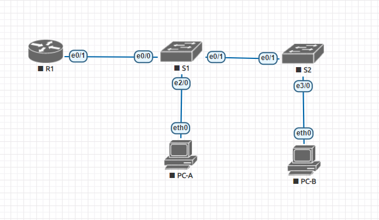

# Lab - Configure Router-on-a-Stick Inter-VLAN Routing
Топология сети:



  Таблица сетевых адресов

| Device | Interface | IP Address   | Subnet Mask     |Default Gateway|
|------- |------    |---------      |---------------- |---------------|
| R1     | e0/1.3   | 192.168.3.1    | 255.255.255.0  | N/A			|
|        | e0/1.4   | 192.168.4.1    | 255.255.255.0  | N/A			|
|        | e0/1.8   | N/A           | N/A             | N/A			|
| S1     | VLAN 3   | 192.168.3.11    | 255.255.255.0 | 192.168.3.1	|
| S2     | VLAN 3   | 192.168.3.12    | 255.255.255.0 | 192.168.3.1	|
| PC-A   | NIC      | 192.168.3.3   | 255.255.255.0   | 192.168.3.1	|
| PC-B   | NIC      | 192.168.4.3    | 255.255.255.0  | 192.168.4.1	|


Таблица VLAN
| VLAN| NAME| Interface Assigned |
|------|----|-------------------|
|8		|VPC8		|SW9: VLAN 8|
|		|			|SW9: e0/2 |
|10		|VPC		|S10: VLAN 10|
|  		|			|SW10: e0/2 |
|30		|VPC30		|S29: VLAN 30|
|  		|			|SW29: e0/0 |
|31		|VPC31		|S29: VLAN 31|
|  		|			|SW29: e0/1 |
|70		|VPC70		|SW4: VLAN 70|
|		|			|SW3: VLAN 70|
|  		|			|SW3: e0/2 |
|100	|VPC100		|SW5: VLAN 100|
|		|			|SW2: VLAN 100|
|  		|			|SW2: e0/2 |
|7		| ParkingLot|SW2: |
|		|			|SW3:|
|		|			|SW4:|
|		|			|SW5:|
|		|			|SW9:|
|		|			|SW10:|
|		|			|SW29:|
|999		| Native	| N/A|
# Часть 1
## Шаг 2: Настройте основные параметры маршрутизатора.

1. Задал имя роутеру:

```
Router(config)#hostname R1
```

2. Чтобы выполнить пункт d, надо было выключить DNS, при помощи команды:

```no ip domain-lookup```

3. Назначил пароль для входа в привилегированный режим
```
R1(config)#enable secret cisco
```
4. Создание пароля для входа в консоль:

```
R1(config)#line con 0
R1(config-line)#password cisco
R1(config-line)#login
```
5. Назначил ```cisco``` в качестве пароля VTY и включил вход

```
R1(config)#line vty 0 4
R1(config-line)#password cisco
R1(config-line)#login
```
6. Захэшировал пароли:
```
R1(config)#service password-encryption
```
7. Создал банер:
```
R1(config)#banner motd #access to this device is prohibited#
```
8. Установил время +3:

```
R1(config)#clock timezone CST +3
```
9. Сохранил конфигурацию: 
```
R1#write memory 
```
## Шаг 3: Настройте основные параметры для каждого коммутатора.

Аналогично предыдущему пункту

## Шаг 4: Настройте хосты ПК.
Задал ip в соответствии с таблицей для PC-A:
```
VPCS> set pcname PC-A
PC-A> ip 192.168.3.3 255.255.255.0 192.168.3.1
```
и для PC-B:
```
VPCS> set pcname PC-B
PC-B> ip 192.168.4.3 255.255.255.0 192.168.4.1
```
# Часть 2
## Шаг 1: Создайте VLAN на обоих коммутаторах
1. Создал vlan:
```
S1(config)#vlan 3
S1(config-vlan)#name Management
S1(config-vlan)#exit
S1(config)#vlan 4
S1(config-vlan)#name Operations
S1(config-vlan)#exit
S1(config)#vlan 7
S1(config-vlan)#name ParkingLot
S1(config-vlan)#exit
S1(config)#vlan 8
S1(config-vlan)#name Native
S1(config-vlan)#exit
```

2. Настроил интерфейс на основе таблицы:
```
interface Vlan3
ip address 192.168.3.11 255.255.255.0
ip default-gateway 192.168.3.1
```
3. Назначил vlan на неиспользуемые порты:
```
S1(config)#int range Ethernet0/2-3 
S1(config-if-range)#switchport mode access
S1(config-if-range)#switchport access vlan 7
```
На остальные интерфейсы по аналогии
## Шаг 2: Назначьте VLAN правильным интерфейсам коммутатора.

1. Настроил интерфейс
```
S1(config)#int et2/0
S1(config-if)#switchport mode access
S1(config-if)#switchport access vlan 3 

```
2. Вывод команды ```show vlan brief``` :
```
VLAN Name                             Status    Ports
---- -------------------------------- --------- -------------------------------
1    default                          active    
3    Management                       active    Et2/0
4    Operations                       active    
7    ParkingLot                       active    Et0/2, Et0/3, Et1/0, Et1/1
                                                Et1/2, Et1/3, Et2/1, Et2/2
                                                Et2/3, Et3/0, Et3/1, Et3/2
                                                Et3/3, Et4/0, Et4/1, Et4/2
                                                Et4/3, Et5/0, Et5/1, Et5/2
                                                Et5/3
8    Native                           active    
1002 fddi-default                     act/unsup 
1003 token-ring-default               act/unsup 
1004 fddinet-default                  act/unsup 
1005 trnet-default                    act/unsup 
```
Aналогичные настройки на S2. Вывод команды ```show vlan brief``` на S2:
```
VLAN Name                             Status    Ports
---- -------------------------------- --------- -------------------------------
1    default                          active    
3    Management                       active    
4    Operations                       active    Et3/0
7    ParkingLot                       active    Et0/0, Et0/2, Et0/3, Et1/0
                                                Et1/1, Et1/2, Et1/3, Et2/0
                                                Et2/1, Et2/2, Et2/3, Et3/1
                                                Et3/2, Et3/3, Et4/0, Et4/1
                                                Et4/2, Et4/3, Et5/0, Et5/1
                                                Et5/2, Et5/3
8    Native                           active    
1002 fddi-default                     act/unsup 
1003 token-ring-default               act/unsup 
1004 fddinet-default                  act/unsup 
1005 trnet-default                    act/unsup 
```
# Часть 3

## Вручную настройте магистральный интерфейс e0/1

1. Изменил режим switchport на интерфейсе F0/1, чтобы принудительно подключить транкинг и настроил согласно таблице: 
```
S1(config)#int et0/1
S1(config-if)#switchport trunk encapsulation dot1q
S1(config-if)#switchport mode trunk
S1(config-if)#switchport trunk native vlan 8
S1(config-if)#switchport trunk allowed vlan 3,4,8
```
Aналогично на S2

2. В качестве проверки настройки просмотрел вызов команды ```show interfaces trunk```:

На S1: 
```
S1#show int trunk 

Port        Mode             Encapsulation  Status        Native vlan
Et0/0       on               802.1q         trunking      8
Et0/1       on               802.1q         trunking      8

Port        Vlans allowed on trunk
Et0/0       3-4,8
Et0/1       3-4,8

Port        Vlans allowed and active in management domain
Et0/0       3-4,8
Et0/1       3-4,8

Port        Vlans in spanning tree forwarding state and not pruned
Et0/0       3-4,8
Et0/1       3-4,8
```
На S2:
```
S2#show int trunk 

Port        Mode             Encapsulation  Status        Native vlan
Et0/1       auto             802.1q         trunking      8

Port        Vlans allowed on trunk
Et0/1       3-4,8

Port        Vlans allowed and active in management domain
Et0/1       3-4,8

Port        Vlans in spanning tree forwarding state and not pruned
Et0/1       3-4,8
```

## Шаг 2 Вручную настройте магистральный интерфейс S1 e0/0

1. Аналогично предыдущему пункту выполнил настройку на интерфейсе e0/0:

```
S1(config)#int et0/0
S1(config-if)#switchport trunk encapsulation dot1q
S1(config-if)#switchport mode trunk
S1(config-if)#switchport trunk native vlan 8
S1(config-if)#switchport trunk allowed vlan 3,4,8
```

2. В качестве проверки настройки просмотрел вызов команды ```show interfaces trunk```:

На S1: 
```
S1#show int trunk 

Port        Mode             Encapsulation  Status        Native vlan
Et0/0       on               802.1q         trunking      8
Et0/1       on               802.1q         trunking      8

Port        Vlans allowed on trunk
Et0/0       3-4,8
Et0/1       3-4,8

Port        Vlans allowed and active in management domain
Et0/0       3-4,8
Et0/1       3-4,8

Port        Vlans in spanning tree forwarding state and not pruned
Et0/0       3-4,8
Et0/1       3-4,8
```

# Часть 4
## Настройка маршрутизации между VLAN на маршрутизаторе

1. Активировал интерфейс е0/1 и настроил подинтерфейсы для каждой VLAN, как указано в таблице IP-адресации. 
```
R1(config)#int et0/1                      
R1(config-if)#no shut
R1(config-if)#no shutdown   
R1(config)#int et0/1.3 
R1(config-subif)#des 
R1(config-subif)#description De
R1(config-subif)#description Def
R1(config-subif)#description Default Gateway for VLAN 3
R1(config-subif)#en
R1(config-subif)#encapsulation do
R1(config-subif)#encapsulation dot1Q 3
R1(config-subif)#ip add
R1(config-subif)#ip address 192.168.3.1 255.255.255.0
R1(config-subif)#exit
R1(config)#int et0/1.4                           
R1(config-subif)#description Default Gateway for VLAN 4
R1(config-subif)#encapsulation dot1Q 4                 
R1(config-subif)#ip address 192.168.4.1 255.255.255.0  
R1(config-subif)#exit
R1(config)#int et0/1.8                           
R1(config-subif)#description Default Gateway for VLAN 8
R1(config-subif)#encapsulation dot1Q 8 native               
R1(config-subif)#exit
R1(config)#int et0/1                           
R1(config-if)#description Trunk link to S1
R1(config-if)#exit
R1(config)#exit
```

# Убедитесь, что маршрутизация между VLAN работает
## Шаг 1: Выполните следующие тесты с помощью PC-A. Все должно быть успешно
1. Ping до шлюза по умолчанию
```
PC-A> ping 192.168.3.1

84 bytes from 192.168.3.1 icmp_seq=1 ttl=255 time=0.336 ms
84 bytes from 192.168.3.1 icmp_seq=2 ttl=255 time=0.582 ms
84 bytes from 192.168.3.1 icmp_seq=3 ttl=255 time=0.593 ms
84 bytes from 192.168.3.1 icmp_seq=4 ttl=255 time=0.550 ms
84 bytes from 192.168.3.1 icmp_seq=5 ttl=255 time=0.578 ms
```
2. Ping до PC-B
```
PC-A> ping 192.168.4.3

84 bytes from 192.168.4.3 icmp_seq=1 ttl=63 time=2.105 ms
84 bytes from 192.168.4.3 icmp_seq=2 ttl=63 time=0.947 ms
84 bytes from 192.168.4.3 icmp_seq=3 ttl=63 time=0.994 ms
84 bytes from 192.168.4.3 icmp_seq=4 ttl=63 time=0.963 ms
84 bytes from 192.168.4.3 icmp_seq=5 ttl=63 time=0.926 ms
```
3. Ping до S2
```
PC-A> ping 192.168.3.12

192.168.3.12 icmp_seq=1 timeout
84 bytes from 192.168.3.12 icmp_seq=2 ttl=255 time=0.633 ms
84 bytes from 192.168.3.12 icmp_seq=3 ttl=255 time=0.859 ms
84 bytes from 192.168.3.12 icmp_seq=4 ttl=255 time=0.639 ms
84 bytes from 192.168.3.12 icmp_seq=5 ttl=255 time=0.631 ms
```
## Выполните следующий тест с помощью PC-B.
```
PC-B>trace 192.168.3.3
trace to 192.168.3.3, 8 hops max, press Ctrl+C to stop
 1   192.168.4.1   0.899 ms  0.532 ms  0.470 ms
 2   *192.168.3.3   0.685 ms (ICMP type:3, code:3, Destination port unreachable)
```
# Работа над ошибками 
Для того, чтобы роутер смог обрабатывать нативный трафик, был привязан нативный vlan к подинтерфейсу et0/1.8. Для этого я добавил в команду ```R1(config-subif)#encapsulation dot1Q 8``` ключевое слово ```native```. 
Команда целиком выглядит следующим образом:
```
R1(config-subif)#encapsulation dot1Q 8 native
```
