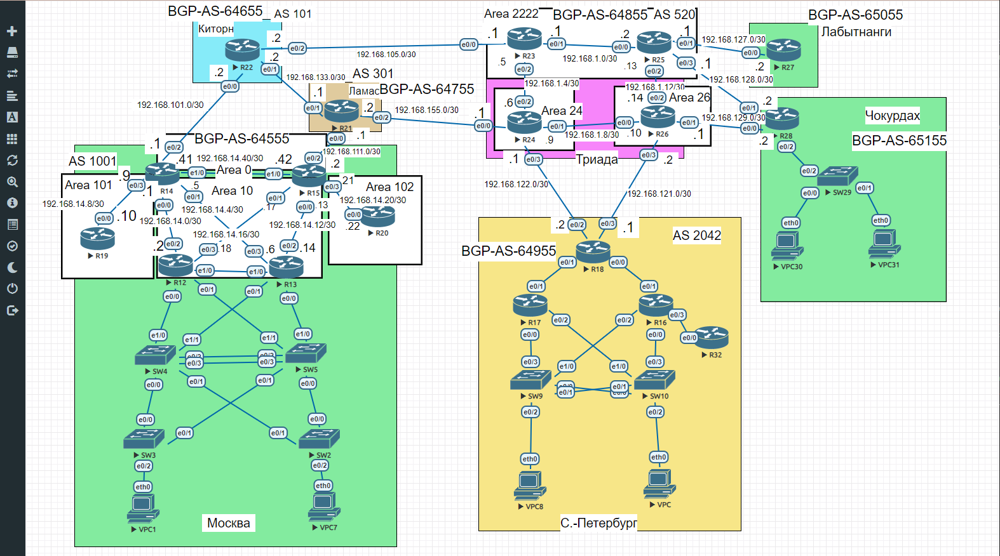

# Домашнее задание
# iBGP

## Цель:
1. Настроить iBGP в офисе Москва
2. Настроить iBGP в сети провайдера Триада
3. Организовать полную IP связанность всех сетей


## Описание/Пошаговая инструкция выполнения домашнего задания:


1. Настроить iBGP в офисе Москва между маршрутизаторами R14 и R15.
2. Настроить iBGP в провайдере Триада, с использованием RR.
3. Настройть офиса Москва так, чтобы приоритетным провайдером стал Ламас.
4. Настройть офиса С.-Петербург так, чтобы трафик до любого офиса распределялся по двум линкам одновременно.
5. Все сети в лабораторной работе должны иметь IP связность.
6. План работы и изменения зафиксированы в документации.
Документация оформлена на github. (желательно использовать markdown).


Топология сети:



## 1. Настроить iBGP в офисе Москва между маршрутизаторами R14 и R15.

1. Для того, чтобы настроить iBGP в офисе Москва между маршрутизаторами R14 и R15. Начнем на R14:

Так как должна быть одной AS в офисе Москвы на R14 и R15, то возял AS 64555. На R14 изначально была данная AS тогда просто добавим нового соседа с той же AS, так как она та же как и R14, то она станет iBGP
```
R14(config)#router bgp 64555
R14(config-router)#neighbor 192.168.14.42 remote-as 64555
```

2. На R15 удалим прошлую AS BGP и создадим AS 64555:
```
R15(config)#no router bgp 64550
R15(config)#router bgp 64555
R15(config-router)#neighbor 192.168.111.1 remote-as 64755
R15(config-router)#neighbor 192.168.14.41 remote-as 64755
R15(config-router)#network 192.168.14.0 mask 255.255.255.0
R15(config-router)#network 192.168.111.0 mask 255.255.255.252
```
3. Так же надо исправить соседа на R21 иначе будет ошибка:

Теперь надо настроить R21
```
R21(config)#router bgp 64755
R21(config-router)#no neighbor 192.168.111.2 remote-as 64550
R21(config-router)#neighbor 192.168.111.2 remote-as 64555
```
4. Настройка iBGP на роутерах R14 и R15 завершена.

## 2. Настроить iBGP в провайдере Триада, с использованием RR.

Чтобы настроить iBGP в провайдере Триада, с использованием RR, необходимо настроить BGP с одой AS R23,R25,R26. R25 и R26 будут клиентами.

 Необходимо выбрать какие из роутеров в Триаде будут RR. Выбрал R24 и R23 так как они стоят на границе для провайдера Киторн и Ламас. 

1. Начнем с R23 и R22:

На R23:
```
R23(config)#router bgp 64855
R23(config-router)#neighbor 192.168.1.14 remote-as 64855
R23(config-router)#neighbor 192.168.105.2 remote-as 64655
R23(config-router)#neighbor 192.168.1.6 remote-as 64855  
R23(config-router)#neighbor 192.168.1.13 remote-as 64855
```

На R22:
```
R22(config)#router bgp 64655
R22(config-router)#neighbor 192.168.105.1 remote-as 64855
```
На R25:
```
R25(config)#router bgp 64855
R25(config-router)#neighbor 192.168.1.1 remote-as 64855
R25(config-router)#neighbor 192.168.1.9 remote-as 64855
```
На R26:
```
R26(config)#router bgp 64855
R26(config-router)#neighbor 192.168.1.1 remote-as 64855
R26(config-router)#neighbor 192.168.1.9 remote-as 64855 
```

На R24 необходимо добавить соседа:
```
R24(config)#router bgp 64855
R24(config-router)#neighbor 192.168.1.10 remote-as 64855
R24(config-router)#neighbor 192.168.1.5 remote-as 64855
R24(config-router)#neighbor 192.168.1.13 remote-as 64855
```
2. Теперь настроим R25 и R26 как клиентов
R24:
```
R24(config)#router bgp 64855
R24(config-router)#neighbor 192.168.1.10 route-reflector-client
R24(config-router)#neighbor 192.168.1.10 next-hop-self 
R24(config-router)#neighbor 192.168.1.13 route-reflector-client
R24(config-router)#neighbor 192.168.1.13 next-hop-self 
```
R23:
```
R23(config)#router bgp 64855
R23(config-router)#neighbor 192.168.1.14 route-reflector-client
R23(config-router)#neighbor 192.168.1.14 next-hop-self
R23(config-router)#neighbor 192.168.1.13 route-reflector-client
R23(config-router)#neighbor 192.168.1.13 next-hop-self 
```

Настройка RR в Триаде подошла к концу.

## 3. Настройть офиса Москва так, чтобы приоритетным провайдером стал Ламас.

Настраивать что-то еще не пришлось, так как у провайдера Киторн длинее AS.

Это видно по таблице BGP в R14:
```
R14#sh ip bgp 
BGP table version is 6, local router ID is 192.168.101.1
Status codes: s suppressed, d damped, h history, * valid, > best, i - internal, 
              r RIB-failure, S Stale, m multipath, b backup-path, f RT-Filter, 
              x best-external, a additional-path, c RIB-compressed, 
Origin codes: i - IGP, e - EGP, ? - incomplete
RPKI validation codes: V valid, I invalid, N Not found

     Network          Next Hop            Metric LocPrf Weight Path
 *>i 192.168.0.0      192.168.111.1            0    100      0 64755 64855 64955 i
 *                    192.168.101.2                          0 64655 64755 64855 64955 i
 * i 192.168.14.0     192.168.14.42            0    100      0 i
 *>                   0.0.0.0                  0         32768 i
 *>  192.168.101.0/30 0.0.0.0                  0         32768 i
 r>i 192.168.111.0/30 192.168.14.42            0    100      0 i
 *>i 192.168.122.0/30 192.168.111.1            0    100      0 64755 64855 64955 i
 *                    192.168.101.2                          0 64655 64755 64855 64955 i
R14#
```
А также видно по таблице BGP в R15:
```
R15#sh ip bgp
BGP table version is 6, local router ID is 192.168.111.2
Status codes: s suppressed, d damped, h history, * valid, > best, i - internal, 
              r RIB-failure, S Stale, m multipath, b backup-path, f RT-Filter, 
              x best-external, a additional-path, c RIB-compressed, 
Origin codes: i - IGP, e - EGP, ? - incomplete
RPKI validation codes: V valid, I invalid, N Not found

     Network          Next Hop            Metric LocPrf Weight Path
 *>  192.168.0.0      192.168.111.1                          0 64755 64855 64955 i
 * i 192.168.14.0     192.168.14.41            0    100      0 i
 *>                   0.0.0.0                  0         32768 i
 r>i 192.168.101.0/30 192.168.14.41            0    100      0 i
 *>  192.168.111.0/30 0.0.0.0                  0         32768 i
 *>  192.168.122.0/30 192.168.111.1                          0 64755 64855 64955 i
```

## 4. Настройть офиса С.-Петербург так, чтобы трафик до любого офиса распределялся по двум линкам одновременно.

Так как BGP Multipath требует совпадения AS path, то он подходит для настройки в офисе С.-Петербург. 

```
R18(config)#  router bgp 64955
R18(config-router)#maximum-paths 2
```

Проверил выполнилась ли команда
```
R18(config-router)#do sho ip bgp
BGP table version is 10, local router ID is 192.168.122.2
Status codes: s suppressed, d damped, h history, * valid, > best, i - internal, 
              r RIB-failure, S Stale, m multipath, b backup-path, f RT-Filter, 
              x best-external, a additional-path, c RIB-compressed, 
Origin codes: i - IGP, e - EGP, ? - incomplete
RPKI validation codes: V valid, I invalid, N Not found

     Network          Next Hop            Metric LocPrf Weight Path
 *>  192.168.0.0      0.0.0.0                  0         32768 i
 *m  192.168.14.0     192.168.121.2                          0 64855 64755 64555 i
 *>                   192.168.122.1                          0 64855 64755 64555 i
 *m  192.168.101.0/30 192.168.121.2                          0 64855 64755 64555 i
 *>                   192.168.122.1                          0 64855 64755 64555 i
 *m  192.168.111.0/30 192.168.121.2                          0 64855 64755 64555 i
 *>                   192.168.122.1                          0 64855 64755 64555 i
 *>  192.168.122.0/30 0.0.0.0                  0         32768 i
```
Судя по таблице теперь используется оба next hop маршрута. Это еще видно в таблице маршрутизации:

```
R18(config-router)#do sh ip ro bgp
Codes: L - local, C - connected, S - static, R - RIP, M - mobile, B - BGP
       D - EIGRP, EX - EIGRP external, O - OSPF, IA - OSPF inter area 
       N1 - OSPF NSSA external type 1, N2 - OSPF NSSA external type 2
       E1 - OSPF external type 1, E2 - OSPF external type 2
       i - IS-IS, su - IS-IS summary, L1 - IS-IS level-1, L2 - IS-IS level-2
       ia - IS-IS inter area, * - candidate default, U - per-user static route
       o - ODR, P - periodic downloaded static route, H - NHRP, l - LISP
       a - application route
       + - replicated route, % - next hop override

Gateway of last resort is 0.0.0.0 to network 0.0.0.0

B     192.168.14.0/24 [20/0] via 192.168.122.1, 00:00:41
                      [20/0] via 192.168.121.2, 00:00:41
      192.168.101.0/30 is subnetted, 1 subnets
B        192.168.101.0 [20/0] via 192.168.122.1, 00:00:41
                       [20/0] via 192.168.121.2, 00:00:41
      192.168.111.0/30 is subnetted, 1 subnets
B        192.168.111.0 [20/0] via 192.168.122.1, 00:00:41
                       [20/0] via 192.168.121.2, 00:00:41
```
## 5. Все сети в лабораторной работе должны иметь IP связность.
Для того, чтобы из офиса Чокурдах могли подключится к любому другому офису, необходимо на R26 прописать маршрут до локальной сети офиса Чокурдах и анонсировать в BGP эту сеть.

```
R26(config)#ip route 192.168.28.0 255.255.255.252 192.168.129.2
R26(config)#router bgp 64855
R26(config-router)#network 192.168.28.0 mask 255.255.255.252
```
Так как маршрут был прописан через интерфейс с адресом 192.168.129.2, то ее тоже придется анонсировать

```
R26(config-router)#network 192.168.129.0 mask 255.255.255.252 
```
RR должны принять от клиента префикс и отправить всем, проверим на R14:
```
R14#sho ip bgp 
BGP table version is 29, local router ID is 192.168.101.1
Status codes: s suppressed, d damped, h history, * valid, > best, i - internal, 
              r RIB-failure, S Stale, m multipath, b backup-path, f RT-Filter, 
              x best-external, a additional-path, c RIB-compressed, 
Origin codes: i - IGP, e - EGP, ? - incomplete
RPKI validation codes: V valid, I invalid, N Not found

     Network          Next Hop            Metric LocPrf Weight Path
 *>i 192.168.0.0      192.168.111.1            0    100      0 64755 64855 64955 i
 *                    192.168.101.2                          0 64655 64755 64855 64955 i
 * i 192.168.14.0     192.168.14.42            0    100      0 i
 *>                   0.0.0.0                  0         32768 i
 *>  192.168.28.0/30  192.168.101.2                          0 64655 64855 i
 * i                  192.168.111.1            0    100      0 64755 64855 i
 *>  192.168.101.0/30 0.0.0.0                  0         32768 i
 r>i 192.168.111.0/30 192.168.14.42            0    100      0 i
 *>i 192.168.122.0/30 192.168.111.1            0    100      0 64755 64855 64955 i
 *                    192.168.101.2                          0 64655 64755 64855 64955 i
     Network          Next Hop            Metric LocPrf Weight Path
 *>  192.168.129.0/30 192.168.101.2                          0 64655 64855 i
 * i                  192.168.111.1            0    100      0 64755 64855 i
```
Проверка доступности c R28:
```
R28#ping 192.168.14.42 source 192.168.28.1
Type escape sequence to abort.
Sending 5, 100-byte ICMP Echos to 192.168.14.42, timeout is 2 seconds:
Packet sent with a source address of 192.168.28.1 
!!!!!
Success rate is 100 percent (5/5), round-trip min/avg/max = 1/1/1 ms
```
Проверка доступности c R14:

```
R14#ping 192.168.28.1 source 192.168.14.1 
Type escape sequence to abort.
Sending 5, 100-byte ICMP Echos to 192.168.28.1, timeout is 2 seconds:
Packet sent with a source address of 192.168.14.1 
!!!!!
Success rate is 100 percent (5/5), round-trip min/avg/max = 1/1/3 ms
```

Теперь осталось анонсировать R27. Для того, чтобы из офиса Лабытнанги могли подключится к любому другому офису.

```
R25(config)#router bgp 64855
R25(config-router)# network 192.168.127.0 mask 255.255.255.252
```
RR должны принять от клиента префикс и отправить всем, проверим на R18:
```
R18(config-router)#do show ip bgp
BGP table version is 34, local router ID is 192.168.122.2
Status codes: s suppressed, d damped, h history, * valid, > best, i - internal, 
              r RIB-failure, S Stale, m multipath, b backup-path, f RT-Filter, 
              x best-external, a additional-path, c RIB-compressed, 
Origin codes: i - IGP, e - EGP, ? - incomplete
RPKI validation codes: V valid, I invalid, N Not found

     Network          Next Hop            Metric LocPrf Weight Path
 *>  192.168.0.0      0.0.0.0                  0         32768 i
 *m  192.168.14.0     192.168.121.2                          0 64855 64755 64555 i
 *>                   192.168.122.1                          0 64855 64755 64555 i
 *m  192.168.28.0/30  192.168.122.1                          0 64855 i
 *>                   192.168.121.2            0             0 64855 i
 *m  192.168.101.0/30 192.168.121.2                          0 64855 64755 64555 i
 *>                   192.168.122.1                          0 64855 64755 64555 i
 *m  192.168.111.0/30 192.168.121.2                          0 64855 64755 64555 i
 *>                   192.168.122.1                          0 64855 64755 64555 i
     Network          Next Hop            Metric LocPrf Weight Path
 *>  192.168.122.0/30 0.0.0.0                  0         32768 i
 *m  192.168.127.0/30 192.168.121.2                          0 64855 i
 *>                   192.168.122.1                          0 64855 i
 *m  192.168.129.0/30 192.168.122.1                          0 64855 i
 *>                   192.168.121.2            0             0 64855 i
```
Проверка доступности c R27:

```
R27#ping 192.168.0.1 
Type escape sequence to abort.
Sending 5, 100-byte ICMP Echos to 192.168.0.1, timeout is 2 seconds:
!!!!!
Success rate is 100 percent (5/5), round-trip min/avg/max = 1/1/1 ms
```


Проверка доступности c R18:
```
R18(config-router)#do ping 192.168.127.2 source 192.168.0.1
Type escape sequence to abort.
Sending 5, 100-byte ICMP Echos to 192.168.127.2, timeout is 2 seconds:
Packet sent with a source address of 192.168.0.1 
!!!!!
Success rate is 100 percent (5/5), round-trip min/avg/max = 1/1/1 ms
```

Видно, что все сети в лабораторной работе имеют IP связность.

