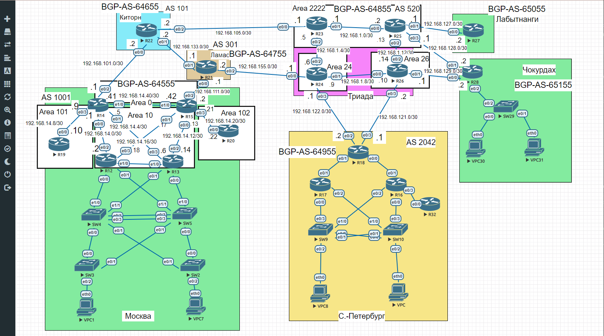

# Домашнее задание
# BGP. Фильтрация

# Цель:
1. Настроить фильтрацию для офисе Москва
2. Настроить фильтрацию для офисе С.-Петербург


## Описание/Пошаговая инструкция выполнения домашнего задания:

1. Настроить фильтрацию в офисе Москва так, чтобы не появилось транзитного трафика(As-path).
2. Настроить фильтрацию в офисе С.-Петербург так, чтобы не появилось транзитного трафика(Prefix-list).
3. Настроить провайдера Киторн так, чтобы в офис Москва отдавался только маршрут по умолчанию.
4. Настроить провайдера Ламас так, чтобы в офис Москва отдавался только маршрут по умолчанию и префикс офиса С.-Петербург.
5. Все сети в лабораторной работе должны иметь IP связность.
6. План работы и изменения зафиксированы в документации.


Топология сети:




## 1. Настроить фильтрацию в офисе Москва так, чтобы не появилось транзитного трафика(As-path).

1. Чтобы настроить фильтрацию в офисе Москва так, чтобы не появилось транзитного трафика надо посмотреть в офисе Москва на R14 и на R15 таблицы BGP:
```
R14#  show ip bgp    
BGP table version is 10, local router ID is 192.168.101.1
Status codes: s suppressed, d damped, h history, * valid, > best, i - internal, 
              r RIB-failure, S Stale, m multipath, b backup-path, f RT-Filter, 
              x best-external, a additional-path, c RIB-compressed, 
Origin codes: i - IGP, e - EGP, ? - incomplete
RPKI validation codes: V valid, I invalid, N Not found

     Network          Next Hop            Metric LocPrf Weight Path
 *   192.168.0.0      192.168.101.2                          0 64655 64755 64855 64955 i
 *>i                  192.168.111.1            0    100      0 64755 64855 64955 i
 * i 192.168.14.0     192.168.14.42            0    100      0 i
 *>                   0.0.0.0                  0         32768 i
 * i 192.168.28.0/30  192.168.111.1            0    100      0 64755 64855 i
 *>                   192.168.101.2                          0 64655 64855 i
 *>  192.168.101.0/30 0.0.0.0                  0         32768 i
 r>i 192.168.111.0/30 192.168.14.42            0    100      0 i
 *   192.168.122.0/30 192.168.101.2                          0 64655 64755 64855 64955 i
 *>i                  192.168.111.1            0    100      0 64755 64855 64955 i
 *>  192.168.127.0/30 192.168.101.2                          0 64655 64855 i
 * i                  192.168.111.1            0    100      0 64755 64855 i
 * i 192.168.129.0/30 192.168.111.1            0    100      0 64755 64855 i
 *>                   192.168.101.2                          0 64655 64855 i
```

```
RBGP table version is 11, local router ID is 192.168.111.2
Status codes: s suppressed, d damped, h history, * valid, > best, i - internal, 
              r RIB-failure, S Stale, m multipath, b backup-path, f RT-Filter, 
              x best-external, a additional-path, c RIB-compressed, 
Origin codes: i - IGP, e - EGP, ? - incomplete
RPKI validation codes: V valid, I invalid, N Not found

     Network          Next Hop            Metric LocPrf Weight Path
 *>  192.168.0.0      192.168.111.1                          0 64755 64855 64955 i
 * i 192.168.14.0     192.168.14.41            0    100      0 i
 *>                   0.0.0.0                  0         32768 i
 *>  192.168.28.0/30  192.168.111.1                          0 64755 64855 i
 * i                  192.168.101.2            0    100      0 64655 64855 i
 r>i 192.168.101.0/30 192.168.14.41            0    100      0 i
 *>  192.168.111.0/30 0.0.0.0                  0         32768 i
 *>  192.168.122.0/30 192.168.111.1                          0 64755 64855 64955 i
 * i 192.168.127.0/30 192.168.101.2            0    100      0 64655 64855 i
 *>                   192.168.111.1                          0 64755 64855 i
 *>  192.168.129.0/30 192.168.111.1                          0 64755 64855 i
 * i                  192.168.101.2            0    100      0 64655 64855 i
```


Чтоб