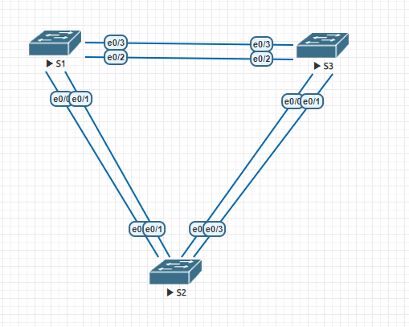

# Лабораторная работа. Развертывание коммутируемой сети с резервными каналами
## Топология сети:



  Таблица сетевых адресов

| Устройство | Интерфейс | IP- адрес   | Маска подсети |
|------- |------    |---------      |---------------- |
| S1     | VLAN 1   | 192.168.1.1    | 255.255.255.0  | 
| S2     | VLAN 1   | 192.168.1.2    | 255.255.255.0 | 
| S3     | VLAN 1   | 192.168.1.3    | 255.255.255.0 | 

## Часть 1:	Создание сети и настройка основных параметров устройства
### Шаг 1:	Создана сеть согласно топологии.
### Шаг 2:	Выполнил инициализацию и перезагрузку коммутаторов.
### Шаг 3:	Настройте базовые параметры каждого коммутатора.
Настройка S1 коммутатора:

1. Отключил поиск DNS:
```
S1(config)#no ip domain-lookup 
```
2. Присвоил имя устройству в соответствии с топологией:
```
Switch(config)#hostname S1
```
3. Назначил ```class``` в качестве зашифрованного пароля доступа к привилегированному режиму:
```
S1(config)#enable secret class
```
4. Назначил ```cisco``` в качестве паролей консоли и VTY и активировал вход для консоли и VTY каналов:
```
S1(config)#line con 0
S1(config-line)#password cisco
S1(config-line)#login
S1(config-line)#exit
S1(config)#line vty 0 4 
S1(config-line)#password cisco
S1(config-line)#login 
```
5. Настроил logging synchronous для консольного канала.
```
S1(config)#line console 0
S1(config-line)#logging synchronous 
```
6. Настроил баннерное сообщение дня (MOTD) для предупреждения пользователей о запрете несанкционированного доступа:
```
S1(config)#banner motd #access to this device is prohibited#
```
7. Задал IP-адрес, указанный в таблице адресации для VLAN 1 на коммутаторе.
```
S1(config)#int vlan 1
S1(config-if)#ip address 192.168.1.1 255.255.255.0
S1(config-if)#no shutdown 
```
8. Скопировал текущую конфигурацию в файл загрузочной конфигурации:
```
S1#copy running-config startup-config
Destination filename [startup-config]? 
Building configuration...
Compressed configuration from 933 bytes to 660 bytes[OK]
```
Аналогично с другими коммутаторами 
### Шаг 4:	Проверьте связь
Проверьте способность компьютеров обмениваться эхо-запросами.

1. Успешно выполняется эхо-запрос от коммутатора S1 на коммутатор S2.
2. Успешно выполняется эхо-запрос от коммутатора S1 на коммутатор S3.
3. Успешно  выполняется эхо-запрос от коммутатора S2 на коммутатор S3.

## Часть 2:	Определение корневого моста

### Шаг 1:	Отключите все порты на коммутаторах
На коммутаторе S1:
```
S1(config)#int range ethernet 0/0-3 
S1(config-if-range)#shutdown 
```
Аналогично на других
### Шаг 2:	Настройте подключенные порты в качестве транковых.
На коммутаторе S1:
```
S1(config)#int range ethernet 0/0-3 
S1(config-if-range)#switchport trunk encapsulation dot1q 
S1(config-if-range)#switchport mode trunk 
```
### Шаг 3:	Включите порты e0/1 и e0/3 на всех коммутаторах.
```
S1(config)#int et 0/1
S1(config-if)#no shutdown 
S1(config)#int et 0/3
S1(config-if)#no shu
S1(config-if)#no shutdown 
```

### Шаг 4:	Отобразите данные протокола spanning-tree.
S1:
```
S1#show spanning-tree 

VLAN0001
  Spanning tree enabled protocol rstp
  Root ID    Priority    32769
             Address     aabb.cc00.1000
             This bridge is the root
             Hello Time   2 sec  Max Age 20 sec  Forward Delay 15 sec

Bridge ID  Priority    32769  (priority 32768 sys-id-ext 1)
             Address     aabb.cc00.1000
             Hello Time   2 sec  Max Age 20 sec  Forward Delay 15 sec
             Aging Time  300 sec

Interface           Role Sts Cost      Prio.Nbr Type
------------------- ---- --- --------- -------- --------------------------------
Et0/1               Desg FWD 100       128.2    Shr 
Et0/3               Desg FWD 100       128.4    Shr 
```

S2:
```
S2#show spanning-tree 

VLAN0001
  Spanning tree enabled protocol rstp
  Root ID    Priority    32769
             Address     aabb.cc00.1000
             Cost        100
             Port        2 (Ethernet0/1)
             Hello Time   2 sec  Max Age 20 sec  Forward Delay 15 sec

  Bridge ID  Priority    32769  (priority 32768 sys-id-ext 1)
             Address     aabb.cc00.3000
             Hello Time   2 sec  Max Age 20 sec  Forward Delay 15 sec
             Aging Time  300 sec

Interface           Role Sts Cost      Prio.Nbr Type
------------------- ---- --- --------- -------- --------------------------------
Et0/1               Root FWD 100       128.2    Shr 
Et0/3               Altn BLK 100       128.4    Shr 
```
S3:
```
S3#show spanning-tree 

VLAN0001
  Spanning tree enabled protocol rstp
  Root ID    Priority    32769
             Address     aabb.cc00.1000
             Cost        100
             Port        4 (Ethernet0/3)
             Hello Time   2 sec  Max Age 20 sec  Forward Delay 15 sec

  Bridge ID  Priority    32769  (priority 32768 sys-id-ext 1)
             Address     aabb.cc00.2000
             Hello Time   2 sec  Max Age 20 sec  Forward Delay 15 sec
             Aging Time  300 sec

Interface           Role Sts Cost      Prio.Nbr Type
------------------- ---- --- --------- -------- --------------------------------
Et0/1               Desg FWD 100       128.2    Shr 
Et0/3               Root FWD 100       128.4    Shr 
```


1. Какой коммутатор является корневым мостом? Почему этот коммутатор был выбран протоколом spanning-tree в качестве корневого моста? 
```Коммутатор выбран корневым, так как у него наименьший Bridge ID, частью которого является МАС адрес.```

2. Какие порты на коммутаторе являются корневыми портами? 
Порт Et0/1 S2 и порт Et0/3 S3.

3. Какие порты на коммутаторе являются назначенными портами?
Порт Et0/1 Et0/3 S1 и порт Et0/1 S3.

4. Какой порт отображается в качестве альтернативного и в настоящее время заблокирован? 
Порт Et0/3 S2.

5. Почему протокол spanning-tree выбрал этот порт в качестве невыделенного (заблокированного) порта?
Минимальный BID соседа S3:  ```32769 + aabb.cc00.2000```

## Часть 3:	Наблюдение за процессом выбора протоколом STP порта, исходя из стоимости портов
### Шаг 1:	Определите коммутатор с заблокированным портом.
Коммутатор S2:
```
S2#show spanning-tree 

VLAN0001
  Spanning tree enabled protocol rstp
  Root ID    Priority    32769
             Address     aabb.cc00.1000
             Cost        100
             Port        2 (Ethernet0/1)
             Hello Time   2 sec  Max Age 20 sec  Forward Delay 15 sec

  Bridge ID  Priority    32769  (priority 32768 sys-id-ext 1)
             Address     aabb.cc00.3000
             Hello Time   2 sec  Max Age 20 sec  Forward Delay 15 sec
             Aging Time  300 sec

Interface           Role Sts Cost      Prio.Nbr Type
------------------- ---- --- --------- -------- --------------------------------
Et0/1               Root FWD 100       128.2    Shr 
Et0/3               Altn BLK 100       128.4    Shr 
```
### Шаг 2:	Измените стоимость порта.
Меняю стоимость на этом порту, так как надо изменить состояние порта ```Et0/3``` с ```Altn``` на ```Desg```. Для этого необходимо пройтись по этапам назначения роли порту:
1.  Минимальный Root Path Cost (RPC)
2. Минимальный Bridge ID (Bridge Priority + SysExtID + Main MAC)
3. Минимальный Port Identifier (Port Priority + PortID) соседа

Для данного свича алгоритм пройдет следующим образом:
1. Минимальный Root Path Cost (RPC):
```
От корневого до порта et0/1 100 (0(root)+100(et0/1))
Так как S2 и S3 обмениваются тоже, то у них будут равные RPC(одинаково расположены от root)

Переходим к следующему этапу распределения ролей
```  
2. Минимальный Bridge ID (Bridge Priority + SysExtID + Main MAC)
```
У S3 меньше Bridge ID (все одинаково, кроме Main MAC, который меньше S2 )
=> Наш порт Et0/3 стал Altn на S2, а на S3 Et0/1 Desg 
```
То есть изменение cost на интерфейсе, который соеденен с S3 не имеет смысла, так как до 3 этапа не дойдет распределение. Поэтому меняем cost на et0/1
```
S2(config)#int et0/1
S2(config-if)#spanning-tree cost 90
```
### Шаг 3:	Просмотрите изменения протокола spanning-tree.

```
S2(config-if)#do show spa

VLAN0001
  Spanning tree enabled protocol rstp
  Root ID    Priority    32769
             Address     aabb.cc00.1000
             Cost        90
             Port        2 (Ethernet0/1)
             Hello Time   2 sec  Max Age 20 sec  Forward Delay 15 sec

  Bridge ID  Priority    32769  (priority 32768 sys-id-ext 1)
             Address     aabb.cc00.3000
             Hello Time   2 sec  Max Age 20 sec  Forward Delay 15 sec
             Aging Time  300 sec

Interface           Role Sts Cost      Prio.Nbr Type
------------------- ---- --- --------- -------- --------------------------------
Et0/1               Root FWD 90        128.2    Shr 
Et0/3               Desg BLK 100       128.4    Shr 
```
### Шаг 4:	Удалите изменения стоимости порта.
```
S2(config)#int et0/1
S2(config-if)#no spanning-tree cost 90
S2(config-if)#do show spa

VLAN0001
  Spanning tree enabled protocol rstp
  Root ID    Priority    32769
             Address     aabb.cc00.1000
             Cost        100
             Port        2 (Ethernet0/1)
             Hello Time   2 sec  Max Age 20 sec  Forward Delay 15 sec

  Bridge ID  Priority    32769  (priority 32768 sys-id-ext 1)
             Address     aabb.cc00.3000
             Hello Time   2 sec  Max Age 20 sec  Forward Delay 15 sec
             Aging Time  300 sec

Interface           Role Sts Cost      Prio.Nbr Type
------------------- ---- --- --------- -------- --------------------------------
Et0/1               Root FWD 100       128.2    Shr 
Et0/3               Altn BLK 100       128.4    Shr 
```


## Часть 4:	Наблюдение за процессом выбора протоколом STP порта, исходя из приоритета портов

1. Включил порты F0/1 и F0/3 на всех коммутаторах.
2. Какой порт выбран протоколом STP в качестве порта корневого моста на каждом коммутаторе некорневого моста? 
Порт с наименьшим приоритетом порта соседа Et0/0 на S2(выбор между et0/0 et0/1) и Et0/2 на S3 (выбор между et0/2 et0/3)

S3
```
S3#show spanning-tree 

VLAN0001
  Spanning tree enabled protocol rstp
  Root ID    Priority    32769
             Address     aabb.cc00.1000
             Cost        100
             Port        3 (Ethernet0/2)
             Hello Time   2 sec  Max Age 20 sec  Forward Delay 15 sec

  Bridge ID  Priority    32769  (priority 32768 sys-id-ext 1)
             Address     aabb.cc00.2000
             Hello Time   2 sec  Max Age 20 sec  Forward Delay 15 sec
             Aging Time  300 sec

Interface           Role Sts Cost      Prio.Nbr Type
------------------- ---- --- --------- -------- --------------------------------
Et0/0               Desg FWD 100       128.1    Shr 
Et0/1               Desg FWD 100       128.2    Shr 
Et0/2               Root FWD 100       128.3    Shr 
Et0/3               Altn BLK 100       128.4    Shr 
```

S2 
```
S2#show spanning-tree 

VLAN0001
  Spanning tree enabled protocol rstp
  Root ID    Priority    32769
             Address     aabb.cc00.1000
             Cost        100
             Port        1 (Ethernet0/0)
             Hello Time   2 sec  Max Age 20 sec  Forward Delay 15 sec

  Bridge ID  Priority    32769  (priority 32768 sys-id-ext 1)
             Address     aabb.cc00.3000
             Hello Time   2 sec  Max Age 20 sec  Forward Delay 15 sec
             Aging Time  300 sec

Interface           Role Sts Cost      Prio.Nbr Type
------------------- ---- --- --------- -------- --------------------------------
Et0/0               Root FWD 100       128.1    Shr 
Et0/1               Altn BLK 100       128.2    Shr 
Et0/2               Altn BLK 100       128.3    Shr 
Et0/3               Altn BLK 100       128.4    Shr 
```
## Вопросы для повторения:
1.	Какое значение протокол STP использует первым после выбора корневого моста, чтобы определить выбор порта?
```COST```
2.	Если первое значение на двух портах одинаково, какое следующее значение будет использовать протокол STP при выборе порта?
```BID```
3.	Если оба значения на двух портах равны, каким будет следующее значение, которое использует протокол STP при выборе порта?
```PID```


## Работа над ошибками
Было:
```
Часть 2:	Определение корневого моста
Шаг 4:	Отобразите данные протокола spanning-tree.

1. Какой коммутатор является корневым мостом? Почему этот коммутатор был выбран протоколом spanning-tree в качестве корневого моста? Коммутатор ```S1``` является корневым, так как у него наименьший мас-адрес.
```
Стало
```
Коммутатор выбран корневым, так как у него наименьший Bridge ID, частью которого является МАС адрес.
```
Было
```
5. Почему протокол spanning-tree выбрал этот порт в качестве невыделенного (заблокированного) порта?
Минимальный BID соседа S3:  ```aabb.cc00.2000```
```
Стало
```
5. Почему протокол spanning-tree выбрал этот порт в качестве невыделенного (заблокированного) порта?
Минимальный BID соседа S3:  ```32769 + aabb.cc00.2000```
```


Было 
```
Часть 4:
Какой порт выбран протоколом STP в качестве порта корневого моста на каждом коммутаторе некорневого моста? Порт с наименьшим приоритетом порта Et0/0 на S2 и Et0/2 на S3.
```
Стало
```
2. Какой порт выбран протоколом STP в качестве порта корневого моста на каждом коммутаторе некорневого моста? 
Порт с наименьшим приоритетом порта соседа Et0/0 на S2(выбор между et0/0 et0/1) и Et0/2 на S3 (выбор между et0/2 et0/3)

```
Так же были переделаны следующие шаги:
```
 Часть 3:	Наблюдение за процессом выбора протоколом STP порта, исходя из стоимости портов
 Шаг 2:	Измените стоимость порта.
 Шаг 3:	Просмотрите изменения протокола spanning-tree.
 Шаг 4:	Удалите изменения стоимости порта.
 ```