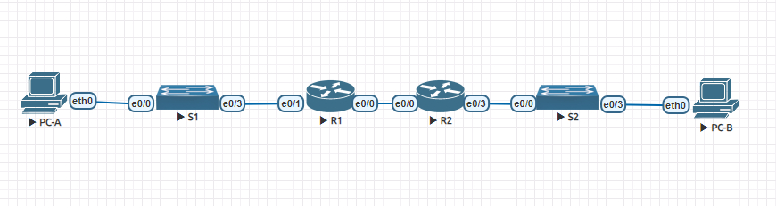

# Lab - Configure Router-on-a-Stick Inter-VLAN Routing

## Топология сети:



  Таблица сетевых адресов

| Device | Interface | IP Address   | Subnet Mask     |Default Gateway|
|------- |------    |---------      |---------------- |---------------|
| R1     | e0/0   | 10.0.0.1    | 255.255.255.252  | N/A			|
|        | e0/1   | N/A    | N/A  | N/A			|
|        | e0/1.100   |     192.168.1.1       |    255.255.255.192          | N/A			|
|         |  e0/1.200    |        192.168.1.65       |       255.255.255.224            |  N/A      |
|         |  e0/1.1000 |   N/A       |              N/A   | N/A       |
| R2     | e0/0   | 10.0.0.2   | 255.255.255.252 | N/A	|
|      | e0/1   |   192.168.1.97  | 255.255.255.240 | N/A	|
|   S1   | VLAN200   | 192.168.1.66    | 255.255.255.224 |192.168.1.65	|
|   S2   | VLAN1   |  192.168.1.98   | 255.255.255.240 |192.168.1.97	|
| PC-A   | NIC      | DHCP   | DHCP   | DHCP	|
| PC-B   | NIC      | DHCP    | DHCP  | DHCP	|


## Таблица VLAN
| VLAN| NAME| Interface Assigned |
|------|----|-------------------|
|1|N/A| S1: e0/3 |
|100| Clients | S1: e0/0|
|200| Management| S1: VLAN 200|
|999|Parking_Lot|S1: e0/1-3 |
|1000| Native| N/A|

## Часть 1: Построение сети и настройка основных параметров устройства

### Шаг 1: Создайте схему адресации

Подсоедините сеть 192.168.1.0/24, чтобы она отвечала следующим требованиям:

1. “Подсеть A”, поддерживающая 58 хостов (клиентская VLAN на R1):
```192.168.1.0/26``` подсеть подддерживает 64 хостов самая маленькая подсеть, которая вмещает 58 хостов.
Первый IP-адрес в таблице адресации для R1 G0/0/1.100:
```192.168.1.1```

2.  “Подсеть B”, поддерживающая 28 хостов (управляющая VLAN на R1): 
```192.168.1.64/27```. Первый IP-адрес в таблице адресации для R1 G0/0/1.200: ```192.168.1.65/27```. Запишите второй IP-адрес в таблице адресов для S1 VLAN 200: ```192.168.1.66/27```и введите соответствующий шлюз по умолчанию: ```192.168.1.95/27```.

3. “Подсеть C”, поддерживающая 12 хостов (клиентская сеть на R2): ```192.168.1.96/28 ```. Запишите первый IP-адрес в таблице адресации для R2 G0/0/1: ```192.168.1.97/28```.

### Шаг 2: Подключите сеть кабелем, как показано в топологии.

### Шаг 3: Настройте основные параметры для каждого маршрутизатора.

1. Назначьте маршрутизатору имя устройства.Откройте окно конфигурации:
```
Router(config)#hostname R1
```
2. Отключите поиск по DNS, чтобы маршрутизатор не пытался перевести неправильно введенные команды так, как если бы они были именами хостов.
```
R1(config)#no ip domain-lookup 
```
3. Назначьте class в качестве привилегированного зашифрованного пароля EXEC.
```
R1(config)#enable secret class
```
4. Назначьте cisco в качестве пароля консоли и включите вход в систему.
```
R1(config)#line console 0
R1(config-line)#password cisco
R1(config-line)#login
```
5. Назначьте cisco в качестве пароля VTY и разрешите вход в систему.
```
R1(config)#line vty 0 4 
R1(config-line)#password cisco
R1(config-line)#login
```
6. Зашифруйте пароли в виде открытого текста.
```
R1(config)#service password-encryption 
```
7. Создайте баннер, предупреждающий любого, кто получает доступ к устройству, о том, что несанкционированный доступ запрещен.
```
R1(config)#banner motd #access to this device is prohibited#
```
8. Сохраните текущую конфигурацию в файле конфигурации запуска.
```
R1#wr me
*Oct  2 18:04:53.497: %SYS-5-CONFIG_I: Configured from console by console
R1#wr mem
Building configuration...
```
9. Установите часы на маршрутизаторе на сегодняшнее время и дату.
Примечание: Используйте знак вопроса (?), чтобы указать правильную последовательность параметров, необходимых для выполнения этой команды.
```
R1(config)#clock timezone CST +3
```
Аналогично с роутером R2

### Шаг 4: Настройте маршрутизацию между VLAN на R1
1. Активируйте интерфейс Et0/1 на маршрутизаторе.
```
R1(config)#int et0/1      
R1(config-if)#no shutdown 
```
2. Настройте подинтерфейсы для каждой VLAN в соответствии с требованиями таблицы IP-адресации. Все подинтерфейсы используют инкапсуляцию 802.1Q, и им присваивается первый доступный адрес из рассчитанного вами пула IP-адресов. Убедитесь, что подинтерфейсу для собственной VLAN не назначен IP-адрес. Включите описание для каждого подинтерфейса.
```
R1(config-if)#int et0/1.100
R1(config-subif)#description Default Geteway for VLAN 100
R1(config-subif)#encapsulation dot1Q 100
R1(config-subif)#ip address 192.168.1.1 255.255.255.192
R1(config-subif)#exit
R1(config)#interface et0/1.200
R1(config-subif)#description Default Geteway for VLAN 200
R1(config-subif)#encapsulation dot1Q 200
R1(config-subif)#ip address 192.168.1.65 255.255.255.224
R1(config-subif)#exit
R1(config)#int et0/1.1000
R1(config-subif)#description Default Geteway for VLAN 1000
R1(config-subif)#encapsulation dot1Q 1000 native
R1(config-subif)#exit
```
3. Убедитесь, что подинтерфейсы работают.
```
R1#show ip interface brief 
Interface                  IP-Address      OK? Method Status                Protocol
Ethernet0/0                unassigned      YES unset  administratively down down    
Ethernet0/1                unassigned      YES unset  up                    up      
Ethernet0/1.100            192.168.1.1     YES manual up                    up      
Ethernet0/1.200            192.168.1.65    YES manual up                    up      
Ethernet0/1.1000           unassigned      YES unset  up                    up      
Ethernet0/2                unassigned      YES unset  administratively down down    
Ethernet0/3                unassigned      YES unset  administratively down down    
```


### Шаг 5: Настройте Et0/3 на R2, затем Et0/0 и статическую маршрутизацию для обоих маршрутизаторов
1. Настройте Et0/3 на R2 с первым IP-адресом подсети C, который вы вычислили ранее.
```
R2(config)#int et0/3
R2(config-if)#ip address 192.168.1.97 255.255.255.240
R2(config-if)#no shutdown
```
2. Настройте интерфейс Et0/0 для каждого маршрутизатора на основе приведенной выше таблицы IP-адресации.
R2:
```
R2(config)#int et0/0
R2(config-if)#ip address 10.0.0.2 255.255.255.252
R2(config-if)#no shutdown
```
R1:
```
R1(config)#int et0/0
R1(config-if)#ip address 10.0.0.1 255.255.255.252
R1(config-if)#no shutdown
```
3. Настройте маршрут по умолчанию на каждом маршрутизаторе, указанном на IP-адрес Et0/0 на другом маршрутизаторе.
```
R1(config)#ip route 0.0.0.0 0.0.0.0 10.0.0.2
R2(config)#ip route 0.0.0.0 0.0.0.0 10.0.0.1
```
4. Убедитесь, что статическая маршрутизация работает, проверив адрес Et0/3 R2 от R1.
```
R1#ping 192.168.1.97       
Type escape sequence to abort.
Sending 5, 100-byte ICMP Echos to 192.168.1.97, timeout is 2 seconds:
!!!!!
Success rate is 100 percent (5/5), round-trip min/avg/max = 1/1/1 ms
```
5. Сохраните текущую конфигурацию в файле конфигурации запуска.
```
R1#wr mem
Building configuration...
R2#wr mem
Building configuration...
```

### Шаг 6: Настройте основные параметры для каждого коммутатора.
1. Назначьте коммутатору имя устройства.
Откройте окно конфигурации
```
```
2. Отключите поиск по DNS, чтобы маршрутизатор не пытался перевести неправильно введенные команды так, как если бы они были именами хостов.
```
```
3. Назначьте class в качестве привилегированного зашифрованного пароля EXEC.
```
```
4. Назначьте cisco в качестве пароля консоли и включите вход в систему.
```
```
5. Назначьте cisco в качестве пароля VTY и разрешите вход в систему.
```
```
6. Зашифруйте пароли в виде открытого текста.
```
```
7. Создайте баннер, предупреждающий любого, кто получает доступ к устройству, о том, что несанкционированный доступ запрещен.
```
```
8. Сохраните текущую конфигурацию в файле конфигурации запуска.
```
```
9. Установите часы на переключателе на сегодняшнее время и дату.
Примечание: Используйте знак вопроса (?), чтобы указать правильную последовательность параметров, необходимых для выполнения этой команды.
```
```
10. Скопируйте текущую конфигурацию в конфигурацию запуска.