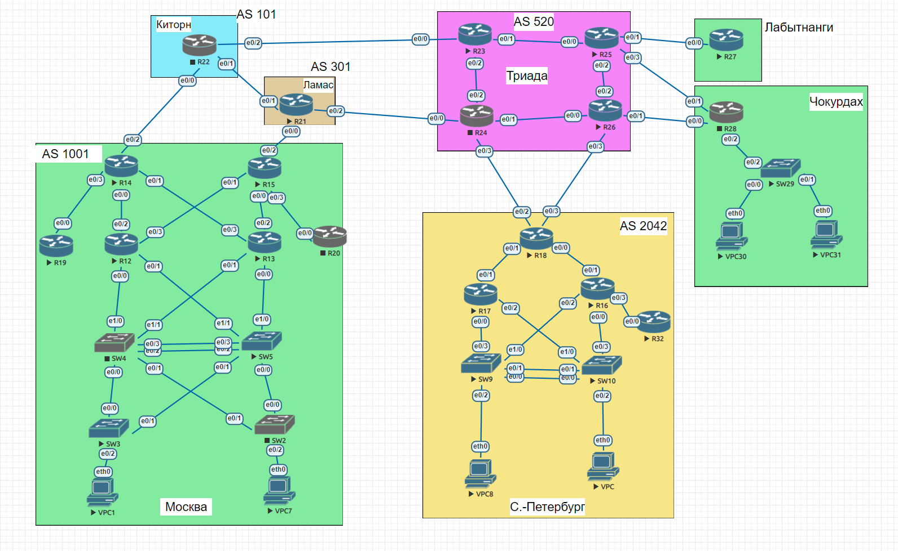

## Домашнее задание
### PBR


Топология сети:



#### Цель:
Настроить политику маршрутизации в офисе Чокурдах
Распределить трафик между 2 линками


### Описание/Пошаговая инструкция выполнения домашнего задания:
В этой самостоятельной работе мы ожидаем, что вы самостоятельно:

1. Настроите политику маршрутизации для сетей офиса.
2. Распределите трафик между двумя линками с провайдером.
3. Настроите отслеживание линка через технологию IP SLA.(только для IPv4)
4. Настройте для офиса Лабытнанги маршрут по-умолчанию.
5. План работы и изменения зафиксированы в документации .
6. Документация оформлена на github. (желательно использовать markdown).

## Настроите политику маршрутизации для сетей офиса.

Для этого задания я решил по аналогии с уроком, перенаправить весь трафик на портах 22 23 ```telnet``` на один из интерфейсов. 
1. Прописал маршруты для того, чтобы проходил ```ping```. Как на switch, так и на router:
```
SW29(config)#ip route 0.0.0.0 0.0.0.0 192.168.28.1
```
```
R28(config)#ip route  10.0.30.0 255.255.255.248 192.168.28.2
```
2. Добавил ```ip address``` для интерфейса switch:
```
SW29(config)#int ethernet 0/2
SW29(config-if)#no switchport
SW29(config-if)#ip address 192.168.28.2 255.255.255.248
```
3. Проверил работоспособность офиса:
```
VPC30> ping 192.168.28.1 

84 bytes from 192.168.28.1 icmp_seq=1 ttl=254 time=0.486 ms
84 bytes from 192.168.28.1 icmp_seq=2 ttl=254 time=0.453 ms
84 bytes from 192.168.28.1 icmp_seq=3 ttl=254 time=0.440 ms
84 bytes from 192.168.28.1 icmp_seq=4 ttl=254 time=0.560 ms
84 bytes from 192.168.28.1 icmp_seq=5 ttl=254 time=0.433 ms
```
## Распределите трафик между двумя линками с провайдером.

1. Определил расширенный access-list:
```
R28(config)#ip access-list extended R25-priority-ONE
R28(config-ext-nacl)#permit tcp any any eq 22 telnet
```
2. Создал route-map:
```
R28(config)#route-map Eth0/1-Telnet-only permit 20
R28(config-route-map)#match ip address R25-priority-ONE
R28(config-route-map)#set ip next-hop 192.168.128.1
```
3. Зафиксировал на интерфейсе:
```
R28(config)#interface et0/2
R28(config-if)#ip policy route-map Eth0/1-Telnet-only
```
PBR - работает: до подключения по telnet к R25
```
R28#  show route-map 
route-map Eth0/1-Telnet-only, permit, sequence 20
  Match clauses:
    ip address (access-lists): Eth0/1-Telnet-only 
  Set clauses:
    ip next-hop 192.168.128.1
  Policy routing matches: 0 packets, 0 bytes
```
Посе подключения по telnet:
```
R28#  show route-map 
route-map Eth0/1-Telnet-only, permit, sequence 20
  Match clauses:
    ip address (access-lists): Eth0/1-Telnet-only 
  Set clauses:
    ip next-hop 192.168.128.1
  Policy routing matches: 58 packets, 3489 bytes
```

Так как маршрутизация в "Триаде" не настроенна, я не создавал правила PBR там, а так можно было по аналогии создать правила на входящих интерфейсах, кроме "E0/3".

## Настроите отслеживание линка через технологию IP SLA.(только для IPv4)

1. Создал правило для пинга ```192.168.1.13```, если он будет недоступен,  ``track`` выключит маршрут из маршрутизации, на котором он прекреплен.
```
R28(config)#ip sla 1
R28(config-ip-sla)#icmp-echo 192.168.1.13 source-ip 192.168.128.2
R28(config-ip-sla-echo)#exit
R28(config)#ip sla schedule 1 life forever start-time now
```
2. Созадем ```track```:
```
R28(config)#track 1 ip sla 1 reachability
R28(config-track)#delay down 90 up 90
R28(config-track)#exit
```
3. Создаем маршрут с ```track``` и запасной вариант:
```
ip route 0.0.0.0 0.0.0.0 192.168.128.1 50 name IPS1 track 1
ip route 0.0.0.0 0.0.0.0 192.168.129.1 100
```
4. Вывод таблицы маршрутизации:
```
R28(config)#do show ip route 
Codes: L - local, C - connected, S - static, R - RIP, M - mobile, B - BGP
       D - EIGRP, EX - EIGRP external, O - OSPF, IA - OSPF inter area 
       N1 - OSPF NSSA external type 1, N2 - OSPF NSSA external type 2
       E1 - OSPF external type 1, E2 - OSPF external type 2
       i - IS-IS, su - IS-IS summary, L1 - IS-IS level-1, L2 - IS-IS level-2
       ia - IS-IS inter area, * - candidate default, U - per-user static route
       o - ODR, P - periodic downloaded static route, H - NHRP, l - LISP
       a - application route
       + - replicated route, % - next hop override

Gateway of last resort is 192.168.128.1 to network 0.0.0.0

S*    0.0.0.0/0 [50/0] via 192.168.128.1
      10.0.0.0/29 is subnetted, 1 subnets
S        10.0.30.0 [1/0] via 192.168.28.2
      192.168.28.0/24 is variably subnetted, 2 subnets, 2 masks
C        192.168.28.0/30 is directly connected, Ethernet0/2
L        192.168.28.1/32 is directly connected, Ethernet0/2
      192.168.128.0/24 is variably subnetted, 2 subnets, 2 masks
C        192.168.128.0/30 is directly connected, Ethernet0/1
L        192.168.128.2/32 is directly connected, Ethernet0/1
      192.168.129.0/24 is variably subnetted, 2 subnets, 2 masks
C        192.168.129.0/30 is directly connected, Ethernet0/0
L        192.168.129.2/32 is directly connected, Ethernet0/0
```

5. После того как я отключил интейрфес на R25, маршрут отключается, из-за недоступности  ```192.168.1.13``` и проподает из таблицы маршрутизации:
```
*Jan 28 11:36:47.599: %TRACK-6-STATE: 1 ip sla 1 reachability Up -> Down
```
```
R28#show ip route 
Codes: L - local, C - connected, S - static, R - RIP, M - mobile, B - BGP
       D - EIGRP, EX - EIGRP external, O - OSPF, IA - OSPF inter area 
       N1 - OSPF NSSA external type 1, N2 - OSPF NSSA external type 2
       E1 - OSPF external type 1, E2 - OSPF external type 2
       i - IS-IS, su - IS-IS summary, L1 - IS-IS level-1, L2 - IS-IS level-2
       ia - IS-IS inter area, * - candidate default, U - per-user static route
       o - ODR, P - periodic downloaded static route, H - NHRP, l - LISP
       a - application route
       + - replicated route, % - next hop override

Gateway of last resort is 192.168.129.1 to network 0.0.0.0

S*    0.0.0.0/0 [100/0] via 192.168.129.1
      10.0.0.0/29 is subnetted, 1 subnets
S        10.0.30.0 [1/0] via 192.168.28.2
      192.168.28.0/24 is variably subnetted, 2 subnets, 2 masks
C        192.168.28.0/30 is directly connected, Ethernet0/2
L        192.168.28.1/32 is directly connected, Ethernet0/2
      192.168.128.0/24 is variably subnetted, 2 subnets, 2 masks
C        192.168.128.0/30 is directly connected, Ethernet0/1
L        192.168.128.2/32 is directly connected, Ethernet0/1
      192.168.129.0/24 is variably subnetted, 2 subnets, 2 masks
C        192.168.129.0/30 is directly connected, Ethernet0/0
L        192.168.129.2/32 is directly connected, Ethernet0/0
```
##  Настройте для офиса Лабытнанги маршрут по-умолчанию.

1. Добавлил на роутер офиса Лабытнанги маршрут по-умолчанию.
```
R27(config)#ip route 0.0.0.0 0.0.0.0 192.168.127.1
```