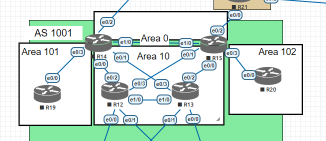

# Домашнее задание
## OSPF

## Цель:
1. Настроить OSPF офисе Москва
2. Разделить сеть на зоны
3. Настроить фильтрацию между зонами


### Описание/Пошаговая инструкция выполнения домашнего задания:
1. Маршрутизаторы R14-R15 находятся в зоне 0 - backbone.
2. Маршрутизаторы R12-R13 находятся в зоне 10. Дополнительно к маршрутам должны получать маршрут по умолчанию.
3. Маршрутизатор R19 находится в зоне 101 и получает только маршрут по умолчанию.
4. Маршрутизатор R20 находится в зоне 102 и получает все маршруты, кроме маршрутов до сетей зоны 101.
5. Настройка для IPv6 повторяет логику IPv4.
6. План работы и изменения зафиксированы в документации . Документация оформлена на github. (желательно использовать markdown).


Топология сети:



## 1. Маршрутизаторы R14-R15 находятся в зоне 0 - backbone.
1. Создал визуальное отображение зоны Area 0 в нее попали et0/2 R14 и et0/2 R15.
2. Включил OSPF на маршрутизаторе R14 на интерфейсе et0/2.
```
R14(config)#int et0/2
R14(config-if)#ip ospf 100 area 0
```
3. Включил OSPF на маршрутизаторе R15 на интерфейсе et0/2.
```
R15(config)#int et0/2
R15(config-if)#ip ospf 100 area 0
```
## 2. Маршрутизаторы R12-R13 находятся в зоне 10. Дополнительно к маршрутам должны получать маршрут по умолчанию.

1. Для того, чтобы R12-R13 могли получать маршруты по умолчанию, добавил loopback-интерфейс и назначил ему ip-адрес
```
R14(config)#interface loopback 1
R14(config)#ip address 64.100.0.1 255.255.255.252
```
2. Чтобы данный адрес распространялся в area 10, необходимо добавить соответствующим интерфейсам  area 10 и инжектировать default route в OSPF:
```
R14(config)#interface range et0/0-1
R14(config-if-range)#ip ospf 100 area 10 
R14(config-if-range)#exit
R14(config)#router ospf 100
R14(config-router)#default-information originate 
R14(config-router)#end
```
Аналогично на R15
```
R15(config)#int loopback 1
R15(config-if)#ip address 64.100.1.1 255.255.255.252
R15(config-if)#exit
R15(config)#ip route 0.0.0.0 0.0.0.0 loopback 1
%Default route without gateway, if not a point-to-point interface, may impact performance
R15(config)#int range et0/0-1
R15(config-if-range)#ip ospf 100 area 10
R15(config-if-range)#exit
R15(config)#router ospf 100
R15(config-router)#default-information originate 
R15(config-router)#end
```

3. Включил на необходимых интерфейсах area 10 на R12-R13:
```
R12(config)#int range et0/0-3
R12(config-if-range)#ip ospf 10 area 10
R12(config-if-range)#exit

R13(config)#interface range et0/0-3
R13(config-if-range)#ip ospf 10 area 10
R13(config-if-range)#exit
```
4. Проверка получения маршрута по умолчанию прошла успешно:
```
R13#show ip route ospf
Codes: L - local, C - connected, S - static, R - RIP, M - mobile, B - BGP
       D - EIGRP, EX - EIGRP external, O - OSPF, IA - OSPF inter area 
       N1 - OSPF NSSA external type 1, N2 - OSPF NSSA external type 2
       E1 - OSPF external type 1, E2 - OSPF external type 2
       i - IS-IS, su - IS-IS summary, L1 - IS-IS level-1, L2 - IS-IS level-2
       ia - IS-IS inter area, * - candidate default, U - per-user static route
       o - ODR, P - periodic downloaded static route, H - NHRP, l - LISP
       a - application route
       + - replicated route, % - next hop override

Gateway of last resort is 192.168.14.13 to network 0.0.0.0

O*E2  0.0.0.0/0 [110/1] via 192.168.14.13, 00:01:08, Ethernet0/2
                [110/1] via 192.168.14.5, 00:01:55, Ethernet0/3
      192.168.14.0/24 is variably subnetted, 13 subnets, 2 masks
O        192.168.14.0/30 [110/20] via 192.168.14.5, 00:04:49, Ethernet0/3
O IA     192.168.14.8/30 [110/20] via 192.168.14.5, 00:04:49, Ethernet0/3
O        192.168.14.16/30 [110/20] via 192.168.14.13, 00:01:08, Ethernet0/2
O        192.168.14.24/30 [110/30] via 192.168.14.13, 00:01:08, Ethernet0/2
                          [110/30] via 192.168.14.5, 00:04:49, Ethernet0/3
O        192.168.14.28/30 [110/30] via 192.168.14.13, 00:01:08, Ethernet0/2
                          [110/30] via 192.168.14.5, 00:04:49, Ethernet0/3
      192.168.101.0/30 is subnetted, 1 subnets
O IA     192.168.101.0 [110/20] via 192.168.14.5, 00:04:49, Ethernet0/3
      192.168.111.0/30 is subnetted, 1 subnets
O IA     192.168.111.0 [110/20] via 192.168.14.13, 00:01:08, Ethernet0/2
```

А также на R12:
```
R12#show ip route ospf
Codes: L - local, C - connected, S - static, R - RIP, M - mobile, B - BGP
       D - EIGRP, EX - EIGRP external, O - OSPF, IA - OSPF inter area 
       N1 - OSPF NSSA external type 1, N2 - OSPF NSSA external type 2
       E1 - OSPF external type 1, E2 - OSPF external type 2
       i - IS-IS, su - IS-IS summary, L1 - IS-IS level-1, L2 - IS-IS level-2
       ia - IS-IS inter area, * - candidate default, U - per-user static route
       o - ODR, P - periodic downloaded static route, H - NHRP, l - LISP
       a - application route
       + - replicated route, % - next hop override

Gateway of last resort is 192.168.14.17 to network 0.0.0.0

O*E2  0.0.0.0/0 [110/1] via 192.168.14.17, 00:01:37, Ethernet0/3
                [110/1] via 192.168.14.1, 00:02:24, Ethernet0/2
      192.168.14.0/24 is variably subnetted, 13 subnets, 2 masks
O        192.168.14.4/30 [110/20] via 192.168.14.1, 00:05:18, Ethernet0/2
O IA     192.168.14.8/30 [110/20] via 192.168.14.1, 00:05:26, Ethernet0/2
O        192.168.14.12/30 [110/20] via 192.168.14.17, 00:01:37, Ethernet0/3
O        192.168.14.32/30 [110/30] via 192.168.14.17, 00:01:37, Ethernet0/3
                          [110/30] via 192.168.14.1, 00:05:18, Ethernet0/2
O        192.168.14.36/30 [110/30] via 192.168.14.17, 00:01:37, Ethernet0/3
                          [110/30] via 192.168.14.1, 00:05:18, Ethernet0/2
      192.168.101.0/30 is subnetted, 1 subnets
O IA     192.168.101.0 [110/20] via 192.168.14.1, 00:05:37, Ethernet0/2
      192.168.111.0/30 is subnetted, 1 subnets
O IA     192.168.111.0 [110/20] via 192.168.14.17, 00:01:37, Ethernet0/3
```

## 3. Маршрутизатор R19 находится в зоне 101 и получает только маршрут по умолчанию.
1. Так как необходимо, чтобы R19 находился в зоне 101 и получал только маршрут по умолчанию, то для этого я выбрал Area Totally-Stub. На R14 на интерфейсе et0/3 закреплю новую area 101 и пропишу, что она Area Totally-Stub:
```
R14(config)#int et0/3
R14(config-if)#ip ospf 100 area 101
R14(config-if)#exit
R14(config)#router ospf 100
R14(config-router)#area 101 stub no-summary 
```
2. На R19 пропишем зону:
```
R19(config)#int et0/0
R19(config-if)#ip ospf 101 area 101
R19(config-if)#exit
R19(config)#router ospf 101
R19(config-router)#area 101 stub 
R19(config-router)#end
```
3. Проверка прошла успешна:
```R19#show ip route ospf
Codes: L - local, C - connected, S - static, R - RIP, M - mobile, B - BGP
       D - EIGRP, EX - EIGRP external, O - OSPF, IA - OSPF inter area 
       N1 - OSPF NSSA external type 1, N2 - OSPF NSSA external type 2
       E1 - OSPF external type 1, E2 - OSPF external type 2
       i - IS-IS, su - IS-IS summary, L1 - IS-IS level-1, L2 - IS-IS level-2
       ia - IS-IS inter area, * - candidate default, U - per-user static route
       o - ODR, P - periodic downloaded static route, H - NHRP, l - LISP
       a - application route
       + - replicated route, % - next hop override

Gateway of last resort is 192.168.14.9 to network 0.0.0.0

O*IA  0.0.0.0/0 [110/11] via 192.168.14.9, 00:02:56, Ethernet0/0
```

## 4. Маршрутизатор R20 находится в зоне 102 и получает все маршруты, кроме маршрутов до сетей зоны 101.
1. Создал ip prefix для блокировки на вход  в 102 area 
```
ip prefix-list block-101 seq 5 deny 192.168.14.10/32
```
2. Добавил в ospf конфигурацию 
```
router ospf 100
 area 102 filter-list prefix block-101 in
```
Но так и не понял как проверить, что R20 получает все маршруты, кроме маршрутов до сетей зоны 101. У R20 есть только маршрут по умолчанию:

```
R20#show ip route ospf
Codes: L - local, C - connected, S - static, R - RIP, M - mobile, B - BGP
       D - EIGRP, EX - EIGRP external, O - OSPF, IA - OSPF inter area 
       N1 - OSPF NSSA external type 1, N2 - OSPF NSSA external type 2
       E1 - OSPF external type 1, E2 - OSPF external type 2
       i - IS-IS, su - IS-IS summary, L1 - IS-IS level-1, L2 - IS-IS level-2
       ia - IS-IS inter area, * - candidate default, U - per-user static route
       o - ODR, P - periodic downloaded static route, H - NHRP, l - LISP
       a - application route
       + - replicated route, % - next hop override

Gateway of last resort is 192.168.14.21 to network 0.0.0.0

O*E2  0.0.0.0/0 [110/1] via 192.168.14.21, 00:33:29, Ethernet0/0
```

## Работа над ошибками

## 1. Маршрутизаторы R14-R15 находятся в зоне 0 - backbone.
1. Создал визуальное отображение зоны Area 0 в нее попали et0/2 R14 и et0/2 R15. ``` Добавил линк между R14-R15 для отказоустойчивости. В area 0 появились еще два интерфейса```
2. Включил OSPF на маршрутизаторе R14 на интерфейсе et0/2.
```
R14(config)#int et0/2
R14(config-if)#ip ospf 100 area 0
```
3. Включил OSPF на маршрутизаторе R15 на интерфейсе et0/2.
```
R15(config)#int et0/2
R15(config-if)#ip ospf 100 area 0
```
4. Назначил ip-адреса для новых интерфейсов и внесу в таблицу ip-адресов в ```Lab4-Архитектура-Сети```:
```
R14(config)#int et0/2       
R14(config-if)#ip address 192.168.14.41 255.255.255.252
R14(config-if)#ip ospf 100 area 0  
... 
R15(config)#int et1/0
R15(config-if)#ip address 192.168.14.42 255.255.255.252
R15(config-if)#ip ospf 100 area 0
```
## 2. Маршрутизаторы R12-R13 находятся в зоне 10. Дополнительно к маршрутам должны получать маршрут по умолчанию.
``` Добавил линк между R12-R13 для отказоустойчивости. В area 0 появились еще два интерфейса```
1. Назначил ip-адреса для новых интерфейсов и внесу в таблицу ip-адресов в ```Lab4-Архитектура-Сети```:
```
R12(config)#int et1/0
R12(config-if)#ip address 192.168.14.45 255.255.255.252
...
R13(config)#int et1/0
R13(config-if)#ip address 192.168.14.46 255.255.255.252
```
2. Для того, чтобы R12-R13 могли получать маршруты по умолчанию, создал маршрут по умолчанию в Null0:
```
R14(config)#ip route 0.0.0.0 0.0.0.0 Null 0
```
3. Чтобы данный адрес распространялся в area 10, необходимо добавить соответствующим интерфейсам  area 10 и инжектировать default route в OSPF:
```
R14(config)#interface range et0/0-1, et1/0
R14(config-if-range)#ip ospf 100 area 10 
R14(config-if-range)#exit
R14(config)#router ospf 100
R14(config-router)#default-information originate 
R14(config-router)#end
```
Аналогично на R15
```
R15(config)#int loopback 1
R15(config-if)#ip address 64.100.1.1 255.255.255.252
R15(config-if)#exit
R15(config)#ip route 0.0.0.0 0.0.0.0 Null 0
R15(config)#interface range et0/0-1, et1/0
R15(config-if-range)#ip ospf 100 area 10
R15(config-if-range)#exit
R15(config)#router ospf 100
R15(config-router)#default-information originate 
R15(config-router)#end
```

4. Включил на необходимых интерфейсах area 10 на R12-R13:
```
R12(config)#int range et0/0-3
R12(config-if-range)#ip ospf 10 area 10
R12(config-if-range)#exit

R13(config)#interface range et0/0-3
R13(config-if-range)#ip ospf 10 area 10
R13(config-if-range)#exit
```
5. Проверка получения маршрута по умолчанию прошла успешно:
```
R12#show ip route ospf
Codes: L - local, C - connected, S - static, R - RIP, M - mobile, B - BGP
       D - EIGRP, EX - EIGRP external, O - OSPF, IA - OSPF inter area 
       N1 - OSPF NSSA external type 1, N2 - OSPF NSSA external type 2
       E1 - OSPF external type 1, E2 - OSPF external type 2
       i - IS-IS, su - IS-IS summary, L1 - IS-IS level-1, L2 - IS-IS level-2
       ia - IS-IS inter area, * - candidate default, U - per-user static route
       o - ODR, P - periodic downloaded static route, H - NHRP, l - LISP
       a - application route
       + - replicated route, % - next hop override

Gateway of last resort is 192.168.14.17 to network 0.0.0.0

O*E2  0.0.0.0/0 [110/1] via 192.168.14.17, 00:00:56, Ethernet0/3
                [110/1] via 192.168.14.1, 00:01:54, Ethernet0/2
      192.168.14.0/24 is variably subnetted, 17 subnets, 2 masks
O        192.168.14.4/30 [110/20] via 192.168.14.1, 00:08:55, Ethernet0/2
O IA     192.168.14.8/30 [110/20] via 192.168.14.1, 00:08:55, Ethernet0/2
O        192.168.14.12/30 [110/20] via 192.168.14.17, 00:08:55, Ethernet0/3
O IA     192.168.14.20/30 [110/20] via 192.168.14.17, 00:08:55, Ethernet0/3
O        192.168.14.32/30 [110/30] via 192.168.14.17, 00:08:55, Ethernet0/3
                          [110/30] via 192.168.14.1, 00:08:55, Ethernet0/2
O        192.168.14.36/30 [110/30] via 192.168.14.17, 00:08:55, Ethernet0/3
                          [110/30] via 192.168.14.1, 00:08:55, Ethernet0/2
O IA     192.168.14.40/30 [110/20] via 192.168.14.17, 00:04:04, Ethernet0/3
                          [110/20] via 192.168.14.1, 00:04:15, Ethernet0/2
      192.168.101.0/30 is subnetted, 1 subnets
O IA     192.168.101.0 [110/20] via 192.168.14.1, 00:08:55, Ethernet0/2
      192.168.111.0/30 is subnetted, 1 subnets
O IA     192.168.111.0 [110/20] via 192.168.14.17, 00:08:55, Ethernet0/3
```

А также на R13:
```
R13(config-if)#do show ip route ospf
Codes: L - local, C - connected, S - static, R - RIP, M - mobile, B - BGP
       D - EIGRP, EX - EIGRP external, O - OSPF, IA - OSPF inter area 
       N1 - OSPF NSSA external type 1, N2 - OSPF NSSA external type 2
       E1 - OSPF external type 1, E2 - OSPF external type 2
       i - IS-IS, su - IS-IS summary, L1 - IS-IS level-1, L2 - IS-IS level-2
       ia - IS-IS inter area, * - candidate default, U - per-user static route
       o - ODR, P - periodic downloaded static route, H - NHRP, l - LISP
       a - application route
       + - replicated route, % - next hop override

Gateway of last resort is 192.168.14.13 to network 0.0.0.0

O*E2  0.0.0.0/0 [110/1] via 192.168.14.13, 00:01:44, Ethernet0/2
                [110/1] via 192.168.14.5, 00:02:42, Ethernet0/3
      192.168.14.0/24 is variably subnetted, 17 subnets, 2 masks
O        192.168.14.0/30 [110/20] via 192.168.14.5, 00:23:50, Ethernet0/3
O IA     192.168.14.8/30 [110/20] via 192.168.14.5, 00:23:50, Ethernet0/3
O        192.168.14.16/30 [110/20] via 192.168.14.13, 00:23:50, Ethernet0/2
O IA     192.168.14.20/30 [110/20] via 192.168.14.13, 00:23:50, Ethernet0/2
O        192.168.14.24/30 [110/30] via 192.168.14.13, 00:09:37, Ethernet0/2
                          [110/30] via 192.168.14.5, 00:09:37, Ethernet0/3
O        192.168.14.28/30 [110/30] via 192.168.14.13, 00:09:37, Ethernet0/2
                          [110/30] via 192.168.14.5, 00:09:37, Ethernet0/3
O IA     192.168.14.40/30 [110/20] via 192.168.14.13, 00:04:52, Ethernet0/2
                          [110/20] via 192.168.14.5, 00:05:03, Ethernet0/3
      192.168.101.0/30 is subnetted, 1 subnets
O IA     192.168.101.0 [110/20] via 192.168.14.5, 00:23:50, Ethernet0/3
      192.168.111.0/30 is subnetted, 1 subnets
O IA     192.168.111.0 [110/20] via 192.168.14.13, 00:23:50, Ethernet0/2
```

## 3. Маршрутизатор R19 находится в зоне 101 и получает только маршрут по умолчанию.
1. Так как необходимо, чтобы R19 находился в зоне 101 и получал только маршрут по умолчанию, то для этого я выбрал Area Totally-Stub. На R14 на интерфейсе et0/3 закреплю новую area 101 и пропишу, что она Area Totally-Stub:
```
R14(config)#int et0/3
R14(config-if)#ip ospf 100 area 101
R14(config-if)#exit
R14(config)#router ospf 100
R14(config-router)#area 101 stub no-summary 
```
2. На R19 пропишем зону:
```
R19(config)#int et0/0
R19(config-if)#ip ospf 101 area 101
R19(config-if)#exit
R19(config)#router ospf 101
R19(config-router)#area 101 stub 
R19(config-router)#end
```
3. Проверка прошла успешна:
```
R19#show ip route ospf
Codes: L - local, C - connected, S - static, R - RIP, M - mobile, B - BGP
       D - EIGRP, EX - EIGRP external, O - OSPF, IA - OSPF inter area 
       N1 - OSPF NSSA external type 1, N2 - OSPF NSSA external type 2
       E1 - OSPF external type 1, E2 - OSPF external type 2
       i - IS-IS, su - IS-IS summary, L1 - IS-IS level-1, L2 - IS-IS level-2
       ia - IS-IS inter area, * - candidate default, U - per-user static route
       o - ODR, P - periodic downloaded static route, H - NHRP, l - LISP
       a - application route
       + - replicated route, % - next hop override

Gateway of last resort is 192.168.14.9 to network 0.0.0.0

O*IA  0.0.0.0/0 [110/11] via 192.168.14.9, 00:24:31, Ethernet0/0
```

## 4. Маршрутизатор R20 находится в зоне 102 и получает все маршруты, кроме маршрутов до сетей зоны 101.
1. Создал ip prefix для блокировки на вход  в 102 area. ```Чтобы анонс всех маршрутов не заблокировался, необходимо добавить разрешаюещее правлило для всего остального трафика```
```
R15(config)#ip prefix-list block-101 deny 192.168.14.8/30          
R15(config)#ip prefix-list block-101 permit 0.0.0.0/0 le 32
```
2. Добавил в ospf конфигурацию 
```
router ospf 100
 area 102 filter-list prefix block-101 in
```
Проверка провел при помощи команды ```show ip route ospf```, действительно маршрут ```192.168.14.8/30``` был не получен:

```
R20#show ip route ospf
Codes: L - local, C - connected, S - static, R - RIP, M - mobile, B - BGP
       D - EIGRP, EX - EIGRP external, O - OSPF, IA - OSPF inter area 
       N1 - OSPF NSSA external type 1, N2 - OSPF NSSA external type 2
       E1 - OSPF external type 1, E2 - OSPF external type 2
       i - IS-IS, su - IS-IS summary, L1 - IS-IS level-1, L2 - IS-IS level-2
       ia - IS-IS inter area, * - candidate default, U - per-user static route
       o - ODR, P - periodic downloaded static route, H - NHRP, l - LISP
       a - application route
       + - replicated route, % - next hop override

Gateway of last resort is 192.168.14.21 to network 0.0.0.0

O*E2  0.0.0.0/0 [110/1] via 192.168.14.21, 00:09:02, Ethernet0/0
      192.168.14.0/24 is variably subnetted, 11 subnets, 2 masks
O IA     192.168.14.0/30 [110/30] via 192.168.14.21, 00:00:24, Ethernet0/0
O IA     192.168.14.4/30 [110/30] via 192.168.14.21, 00:00:24, Ethernet0/0
O IA     192.168.14.12/30 [110/20] via 192.168.14.21, 00:00:24, Ethernet0/0
O IA     192.168.14.16/30 [110/20] via 192.168.14.21, 00:00:24, Ethernet0/0
O IA     192.168.14.24/30 [110/30] via 192.168.14.21, 00:00:24, Ethernet0/0
O IA     192.168.14.28/30 [110/30] via 192.168.14.21, 00:00:24, Ethernet0/0
O IA     192.168.14.32/30 [110/30] via 192.168.14.21, 00:00:24, Ethernet0/0
O IA     192.168.14.36/30 [110/30] via 192.168.14.21, 00:00:24, Ethernet0/0
O IA     192.168.14.40/30 [110/20] via 192.168.14.21, 00:00:24, Ethernet0/0
      192.168.101.0/30 is subnetted, 1 subnets
O IA     192.168.101.0 [110/30] via 192.168.14.21, 00:00:24, Ethernet0/0
      192.168.111.0/30 is subnetted, 1 subnets
O IA     192.168.111.0 [110/20] via 192.168.14.21, 00:00:24, Ethernet0/0
```
