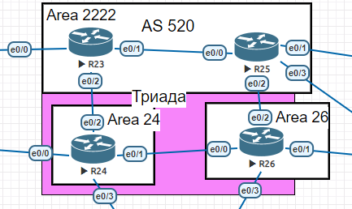

## Домашнее задание
```IS-IS```

## Цель:
Настроить IS-IS офисе Триада


## Описание/Пошаговая инструкция выполнения домашнего задания:
1. Настроите IS-IS в ISP Триада.
2. R23 и R25 находятся в зоне 2222.
3. R24 находится в зоне 24.
4. R26 находится в зоне 26.

## 1. Настроите IS-IS в ISP Триада.
1. Добавил визуально зоны для офиса Триада:
Топология сети:



### 1.1. Настройка зоны 2222 на роутерах R23 и R25:
1. На роутере R23 настроил ISIS с индетификатором ``` 00000023 ``` в area 2222:
```
R23(config)#router isis
R23(config-router)#net 49.2222.0000.0023.00
R23(config-router)#exit
R23(config)#int range et0/1-2
R23(config-if-range)#ip router isis
R23(config-if-range)#exit 
```
2. Аналогично на R25:
```
R25(config)#router isis             
R25(config-router)#net 49.2222.0000.0025.00   
R25(config-router)#exit
R25(config)#int range et0/0,et0/2
R25(config-if-range)#ip router isis
R25(config-if-range)#exit
```
### 1.2. Настройка зоны 24 на роутере R24
1. На роутере R24 настроил ISIS с индетификатором ``` 00000024 ``` в area 24:
```
R24(config)#router isis
R24(config-router)#net 49.0024.0000.0024.00
R24(config-router)#exit
R24(config)#interface range et0/1-2
R24(config-if-range)#ip router isis
R24(config-if-range)#exit
```
### 1.2. Настройка зоны 24 на роутере R26
1. На роутере R26 настроил ISIS с индетификатором ``` 00000026 ``` в area 26:
```
R26(config)#router isis
R26(config-router)#net 49.0026.0000.0026.00
R26(config-router)#exit
R26(config)#interface range ethernet0/0, ethernet 0/2
R26(config-if-range)#ip router isis 
R26(config-if-range)#exit
```

```Специально не включил ISIS на интерфейсах выходящие в дургии филиалы, так как  к офису Триада может получить доступ к маршрутной информации любой подключенный роутер с ISIS. Так же для более отказоустойчевости системы между R23 и R25 оставил возможность проходить L1, L2 ```

## 2. Проверка на R25 получения всех не подключенных на прямую IP-маршрутов от интерфейсов в ISIS

```
R25(config)#do show ip route isis
Codes: L - local, C - connected, S - static, R - RIP, M - mobile, B - BGP
       D - EIGRP, EX - EIGRP external, O - OSPF, IA - OSPF inter area 
       N1 - OSPF NSSA external type 1, N2 - OSPF NSSA external type 2
       E1 - OSPF external type 1, E2 - OSPF external type 2
       i - IS-IS, su - IS-IS summary, L1 - IS-IS level-1, L2 - IS-IS level-2
       ia - IS-IS inter area, * - candidate default, U - per-user static route
       o - ODR, P - periodic downloaded static route, H - NHRP, l - LISP
       a - application route
       + - replicated route, % - next hop override

Gateway of last resort is 192.168.128.2 to network 0.0.0.0

      192.168.1.0/24 is variably subnetted, 6 subnets, 2 masks
i L1     192.168.1.4/30 [115/20] via 192.168.1.1, 00:52:34, Ethernet0/0
i L1     192.168.1.8/30 [115/20] via 192.168.1.14, 00:46:03, Ethernet0/2
```