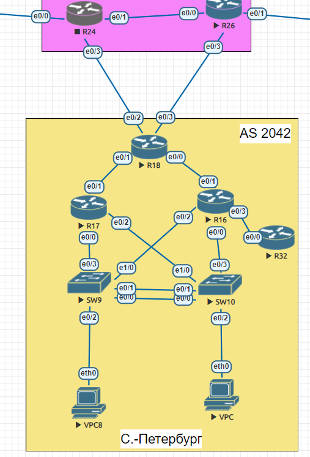

## Домашнее задание
# EIGRP

## Цель:
Настроить EIGRP в С.-Петербург;
Использовать named EIGRP


## Описание/Пошаговая инструкция выполнения домашнего задания:
1. В офисе С.-Петербург настроить EIGRP.
2. R32 получает только маршрут по умолчанию.
3. R16-17 анонсируют только суммарные префиксы.
4. Использовать EIGRP named-mode для настройки сети.


Топология сети:



### 1. В офисе С.-Петербург настроить EIGRP

Для настройки протокола EIGRP использовал команда router eigrp AS-#. Адрес, настроил с помощью команды настройки маршрутизатора eigrp router-id адрес-ipv4, а так же использовал команду настройки маршрутизатораnetwork номер-сети, чтобы включить и объявить сети в EIGRP.
```   
R17(config)#router eigrp 1
R17(config-router)#eigrp router-id 17.17.17.17
R17(config-router)#network 192.168.0.9 255.255.255.252
R17(config-router)#network 192.168.0.13 255.255.255.252
R17(config-router)#network 192.168.0.6 255.255.255.252
```
Аналогично на R18

```
R18(config)#router eigrp 1
R18(config-router)#eigrp router-id 18.18.18.18
R18(config-router)#network 192.168.122.2 255.255.255.252
R18(config-router)#network 192.168.121.1 255.255.255.252
R18(config-router)#network 192.168.0.1 255.255.255.252
R18(config-router)#network 192.168.0.5 255.255.255.252
```
Аналогично на R16

```
R16(config)#  router eigrp 1
R16(config-router)#eigrp router-id 16.16.16.16
R16(config-router)#network 192.168.0.17 255.255.255.252
R16(config-router)#network 192.168.0.2 255.255.255.252
R16(config-router)#network 192.168.0.21 255.255.255.252
R16(config-router)#network 192.168.0.26 255.255.255.252
```
Аналогично на R32
```
R32(config)#router eigrp 1
R32(config-router)#eigrp router-id 32.32.32.32
R32(config-router)#network 192.168.0.25 255.255.255.252
```

## 2. R32 получает только маршрут по умолчанию:

Прописал маршрут по умолчанию в сторону R24, как c главного роутера С.-Петербурга
```
R18(config)#ip route 0.0.0.0 0.0.0.0 ethernet 0/2
%Default route without gateway, if not a point-to-point interface, may impact performance
```
Команда ```redistribute static``` указывает протоколу EIGRP включить статические маршруты в обновления EIGRP для других маршрутизаторов.
```
R18(config)#router eigrp 1
R18(config-router)#redistribute static 
```
Теперь надо ограничить R32 так, чтобы он получал только маршрут по умолчанию
```
R32(config)#access-list 1 permit 0.0.0.0
R32(config)#route-map EIGRP-DENY-DEFAULT permit 10
R32(config-route-map)#match ip address 1
R32(config-route-map)#exit
R32(config)#router eigrp 1
R32(config-router)#distribute-list route-map EIGRP-DENY-DEFAULT in
```


Проверил настройку ниже 
```
R32#show ip route eigrp
Codes: L - local, C - connected, S - static, R - RIP, M - mobile, B - BGP
       D - EIGRP, EX - EIGRP external, O - OSPF, IA - OSPF inter area 
       N1 - OSPF NSSA external type 1, N2 - OSPF NSSA external type 2
       E1 - OSPF external type 1, E2 - OSPF external type 2
       i - IS-IS, su - IS-IS summary, L1 - IS-IS level-1, L2 - IS-IS level-2
       ia - IS-IS inter area, * - candidate default, U - per-user static route
       o - ODR, P - periodic downloaded static route, H - NHRP, l - LISP
       a - application route
       + - replicated route, % - next hop override

Gateway of last resort is 192.168.0.26 to network 0.0.0.0

D*EX  0.0.0.0/0 [170/332800] via 192.168.0.26, 00:01:32, Ethernet0/0
```
## 3. Настройка автоматического объединения EIGRP на роутерах R16-17:

Чтобы включить автоматическое объединение для EIGRP, использовал команду auto-summary в режиме конфигурации маршрутизатора, как показано в командах ниже:
```   
R17(config)#router eigrp 1
R17(config-router)#auto-summary 
```

```
R16(config)#  router eigrp 1
R16(config-router)#auto-summary 
```
Определил, отключено ли автоматическое объединение EIGRP, с помощью команды show ip protocols.
```
R16#show ip protocols 
*** IP Routing is NSF aware ***

Routing Protocol is "application"
  Sending updates every 0 seconds
  Invalid after 0 seconds, hold down 0, flushed after 0
  Outgoing update filter list for all interfaces is not set
  Incoming update filter list for all interfaces is not set
  Maximum path: 32
  Routing for Networks:
  Routing Information Sources:
    Gateway         Distance      Last Update
  Distance: (default is 4)

Routing Protocol is "eigrp 1"
  Outgoing update filter list for all interfaces is not set
  Incoming update filter list for all interfaces is not set
  Default networks flagged in outgoing updates
  Default networks accepted from incoming updates
  EIGRP-IPv4 Protocol for AS(1)
    Metric weight K1=1, K2=0, K3=1, K4=0, K5=0
    NSF-aware route hold timer is 240
    Router-ID: 16.16.16.16
    Topology : 0 (base) 
      Active Timer: 3 min
      Distance: internal 90 external 170
      Maximum path: 4
      Maximum hopcount 100
      Maximum metric variance 1

  Automatic Summarization: enabled
  Maximum path: 4
  Routing for Networks:
    192.168.0.0/30
    192.168.0.16/30
    192.168.0.20/30
    192.168.0.24/30
  Routing Information Sources:
    Gateway         Distance      Last Update
    192.168.0.1           90      00:00:45
    192.168.0.25          90      00:28:33
  Distance: internal 90 external 170
```
```
R17#show ip protocols 
*** IP Routing is NSF aware ***

Routing Protocol is "application"
  Sending updates every 0 seconds
  Invalid after 0 seconds, hold down 0, flushed after 0
  Outgoing update filter list for all interfaces is not set
  Incoming update filter list for all interfaces is not set
  Maximum path: 32
  Routing for Networks:
  Routing Information Sources:
    Gateway         Distance      Last Update
  Distance: (default is 4)

Routing Protocol is "eigrp 1"
  Outgoing update filter list for all interfaces is not set
  Incoming update filter list for all interfaces is not set
  Default networks flagged in outgoing updates
  Default networks accepted from incoming updates
  EIGRP-IPv4 Protocol for AS(1)
    Metric weight K1=1, K2=0, K3=1, K4=0, K5=0
    NSF-aware route hold timer is 240
    Router-ID: 17.17.17.17
    Topology : 0 (base) 
      Active Timer: 3 min
      Distance: internal 90 external 170
      Maximum path: 4
      Maximum hopcount 100
      Maximum metric variance 1

  Automatic Summarization: enabled
  Maximum path: 4
  Routing for Networks:
    192.168.0.4/30
    192.168.0.8/30
    192.168.0.12/30
  Routing Information Sources:
    Gateway         Distance      Last Update
    192.168.0.5           90      00:39:50
  Distance: internal 90 external 170
```
Видно, что автоматическое объединение EIGRP включенно, но по какой то причине маршруты остались теми же, смотрел даже на R18, так как на нем по логиге должно был изменится вывод маршрутов:

```
R16#    show ip eigrp topology all-links
EIGRP-IPv4 Topology Table for AS(1)/ID(16.16.16.16)
Codes: P - Passive, A - Active, U - Update, Q - Query, R - Reply,
       r - reply Status, s - sia Status 

P 192.168.0.8/30, 1 successors, FD is 332800, serno 8
        via 192.168.0.1 (332800/307200), Ethernet0/1
P 192.168.0.4/30, 1 successors, FD is 307200, serno 5
        via 192.168.0.1 (307200/281600), Ethernet0/1
P 192.168.0.16/30, 1 successors, FD is 281600, serno 2
        via Connected, Ethernet0/0
P 192.168.0.0/30, 1 successors, FD is 281600, serno 1
        via Connected, Ethernet0/1
P 192.168.0.24/30, 1 successors, FD is 281600, serno 4
        via Connected, Ethernet0/3
P 192.168.0.20/30, 1 successors, FD is 281600, serno 3
        via Connected, Ethernet0/2
P 192.168.122.0/30, 1 successors, FD is 307200, serno 7
        via 192.168.0.1 (307200/281600), Ethernet0/1
P 192.168.0.12/30, 1 successors, FD is 332800, serno 9
        via 192.168.0.1 (332800/307200), Ethernet0/1
P 192.168.121.0/30, 1 successors, FD is 307200, serno 6
        via 192.168.0.1 (307200/281600), Ethernet0/1
R16#show ip route eigrp
Codes: L - local, C - connected, S - static, R - RIP, M - mobile, B - BGP
       D - EIGRP, EX - EIGRP external, O - OSPF, IA - OSPF inter area 
       N1 - OSPF NSSA external type 1, N2 - OSPF NSSA external type 2
       E1 - OSPF external type 1, E2 - OSPF external type 2
       i - IS-IS, su - IS-IS summary, L1 - IS-IS level-1, L2 - IS-IS level-2
       ia - IS-IS inter area, * - candidate default, U - per-user static route
       o - ODR, P - periodic downloaded static route, H - NHRP, l - LISP
       a - application route
       + - replicated route, % - next hop override

Gateway of last resort is not set

      192.168.0.0/24 is variably subnetted, 11 subnets, 2 masks
D        192.168.0.4/30 [90/307200] via 192.168.0.1, 00:28:57, Ethernet0/1
D        192.168.0.8/30 [90/332800] via 192.168.0.1, 00:28:54, Ethernet0/1
D        192.168.0.12/30 [90/332800] via 192.168.0.1, 00:28:54, Ethernet0/1
      192.168.121.0/30 is subnetted, 1 subnets
D        192.168.121.0 [90/307200] via 192.168.0.1, 00:28:57, Ethernet0/1
      192.168.122.0/30 is subnetted, 1 subnets
D        192.168.122.0 [90/307200] via 192.168.0.1, 00:28:57, Ethernet0/1
```

```
R18#show ip eigrp topology all-links 
EIGRP-IPv4 Topology Table for AS(1)/ID(18.18.18.18)
Codes: P - Passive, A - Active, U - Update, Q - Query, R - Reply,
       r - reply Status, s - sia Status 

P 192.168.0.8/30, 1 successors, FD is 307200, serno 8
        via 192.168.0.6 (307200/281600), Ethernet0/1
P 192.168.0.4/30, 1 successors, FD is 281600, serno 2
        via Connected, Ethernet0/1
P 192.168.0.16/30, 1 successors, FD is 307200, serno 5
        via 192.168.0.2 (307200/281600), Ethernet0/0
P 192.168.0.0/30, 1 successors, FD is 281600, serno 1
        via Connected, Ethernet0/0
P 192.168.0.24/30, 1 successors, FD is 307200, serno 7
        via 192.168.0.2 (307200/281600), Ethernet0/0
P 192.168.0.20/30, 1 successors, FD is 307200, serno 6
        via 192.168.0.2 (307200/281600), Ethernet0/0
P 192.168.122.0/30, 1 successors, FD is 281600, serno 4
        via Connected, Ethernet0/2
P 192.168.0.12/30, 1 successors, FD is 307200, serno 9
        via 192.168.0.6 (307200/281600), Ethernet0/1
P 192.168.121.0/30, 1 successors, FD is 281600, serno 3
        via Connected, Ethernet0/3
R18#show ip route eigrp 
Codes: L - local, C - connected, S - static, R - RIP, M - mobile, B - BGP
       D - EIGRP, EX - EIGRP external, O - OSPF, IA - OSPF inter area 
       N1 - OSPF NSSA external type 1, N2 - OSPF NSSA external type 2
       E1 - OSPF external type 1, E2 - OSPF external type 2
       i - IS-IS, su - IS-IS summary, L1 - IS-IS level-1, L2 - IS-IS level-2
       ia - IS-IS inter area, * - candidate default, U - per-user static route
       o - ODR, P - periodic downloaded static route, H - NHRP, l - LISP
       a - application route
       + - replicated route, % - next hop override

Gateway of last resort is not set

      192.168.0.0/24 is variably subnetted, 9 subnets, 2 masks
D        192.168.0.8/30 [90/307200] via 192.168.0.6, 00:42:19, Ethernet0/1
D        192.168.0.12/30 [90/307200] via 192.168.0.6, 00:42:19, Ethernet0/1
D        192.168.0.16/30 [90/307200] via 192.168.0.2, 00:42:23, Ethernet0/0
D        192.168.0.20/30 [90/307200] via 192.168.0.2, 00:42:23, Ethernet0/0
D        192.168.0.24/30 [90/307200] via 192.168.0.2, 00:42:23, Ethernet0/0
R18#
```

## 4. Использовать EIGRP named-mode для настройки сети.
Для этого необходимо не только заменить ```router eigrp 1``` на ```router eigrp EIGRP-Piter```. Необходимо также использовать ```address-family ipv4 unicast autonomous-system 1``` для настрйки ipv4 на всех роутерах. Использовать ```topology base ``` для настроек по типу ```auto-summary``` или иних специфических настроек. Новые конфигурации находятся в папке ```configs ```

R18
```
router eigrp EIGRP-Piter
 !
 address-family ipv4 unicast autonomous-system 1
  !
  topology base
   redistribute static
  exit-af-topology
  network 192.168.0.0
  network 192.168.121.0
  network 192.168.122.0
  eigrp router-id 18.18.18.18
 exit-address-family
!
```
R17
```
router eigrp EIGRP-Piter
 !
 address-family ipv4 unicast autonomous-system 1
  !
   topology base
   auto-summary
  exit-af-topology
  network 192.168.0.4 0.0.0.3
  network 192.168.0.8 0.0.0.3
  network 192.168.0.12 0.0.0.3
  eigrp router-id 17.17.17.17
 exit-address-family
!
```
R16
```
router eigrp EIGRP-Piter
 !
 address-family ipv4 unicast autonomous-system 1
  !
   topology base
   auto-summary
  exit-af-topology
  network 192.168.0.0 0.0.0.3
  network 192.168.0.16 0.0.0.3
  network 192.168.0.20 0.0.0.3
  network 192.168.0.24 0.0.0.3
  eigrp router-id 16.16.16.16
 exit-address-family
```
R32
```
router eigrp EIGRP-Piter
 !
 address-family ipv4 unicast autonomous-system 1
  !
  topology base
   distribute-list route-map EIGRP-DENY-DEFAULT in 
  exit-af-topology
  network 192.168.0.24 0.0.0.3
  eigrp router-id 32.32.32.32
 exit-address-family
!
```


## Работа над ошибками 

### 3. Настройка автоматического объединения EIGRP на роутерах R16-17:

1. Так как использовать автоматическую суммаризацию - это весьма опасный и топорный инструмент. Оптимальный и безопасный ход это создать статическую суммаризацию на интерфейсах в сторону R18. Авто суммаризацию отключил.

2. Для ручной настройки сумарного маршрута в именованный EIGRP. В R17, так как ```192.168.0.8/30``` ```192.168.0.12/30```, то их можно суммаризировать в ```192.168.0.8/29```
```
R17(config)# router eigrp EIGRP-Piter 
R17(config-router)#address-family ipv4 unicast autonomous-system 1
R17(config-router-af)#af-interface ethernet 0/1
R17(config-router-af-interface)#summary-address 192.168.0.8 255.255.255.248
```
3. Для ручной настройки сумарного маршрута в именованный EIGRP. В R16, так как ```192.168.0.16/30``` ```192.168.0.20/30``` ```192.168.0.24/30```, то их можно суммаризировать в ```192.168.0.16/28```
```
R16(config)#router eigrp EIGRP-Piter
R16(config-router)#address-family ipv4 unicast autonomous-system 1
R16(config-router-af)#af-interface ethernet 0/1
R16(config-router-af-interface)#summary-address 192.168.0.16 255.255.255.240
```
4. На R18 успешно пришли суммарные маршруты.
```
R18#show ip route eigrp 
Codes: L - local, C - connected, S - static, R - RIP, M - mobile, B - BGP
       D - EIGRP, EX - EIGRP external, O - OSPF, IA - OSPF inter area 
       N1 - OSPF NSSA external type 1, N2 - OSPF NSSA external type 2
       E1 - OSPF external type 1, E2 - OSPF external type 2
       i - IS-IS, su - IS-IS summary, L1 - IS-IS level-1, L2 - IS-IS level-2
       ia - IS-IS inter area, * - candidate default, U - per-user static route
       o - ODR, P - periodic downloaded static route, H - NHRP, l - LISP
       a - application route
       + - replicated route, % - next hop override

Gateway of last resort is 0.0.0.0 to network 0.0.0.0

      192.168.0.0/24 is variably subnetted, 6 subnets, 4 masks
D        192.168.0.8/29 [90/1536000] via 192.168.0.6, 00:10:30, Ethernet0/1
D        192.168.0.16/28 [90/1536000] via 192.168.0.2, 00:00:08, Ethernet0/0
R18#
```