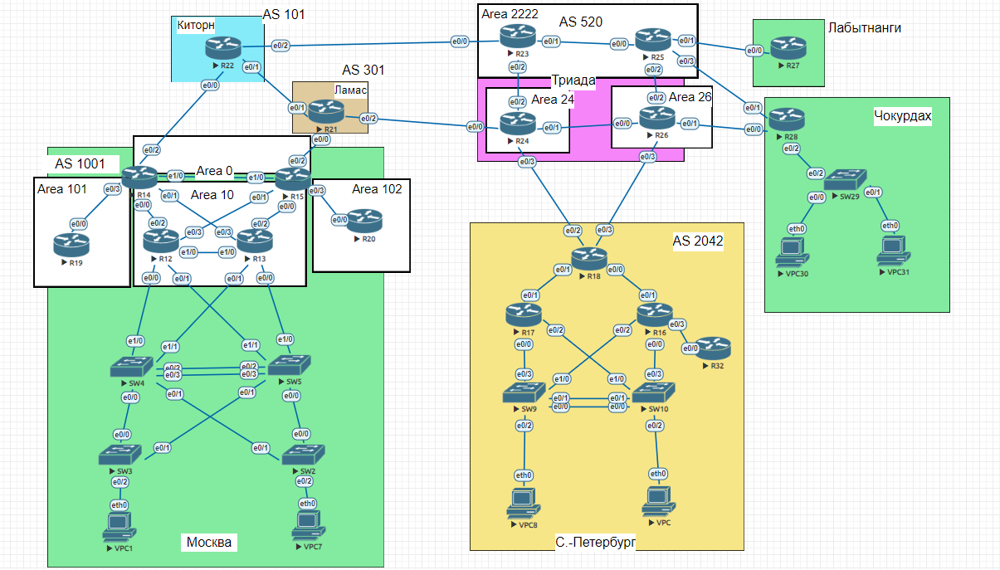

# Домашнее задание
# BGP. Основы

## Цель:
Настроить BGP между автономными системами
Организовать доступность между офисами Москва и С.-Петербург


## Описание/Пошаговая инструкция выполнения домашнего задания:

1. Настроить eBGP между офисом Москва и двумя провайдерами - Киторн и Ламас.
2. Настроить eBGP между провайдерами Киторн и Ламас.
3. Настроить eBGP между Ламас и Триада.
4. Настроить eBGP между офисом С.-Петербург и провайдером Триада.
5. Организовать IP доступность между пограничным роутерами офисами Москва и С.-Петербург.
6. План работы и изменения зафиксировать в документации. 

Топология сети:



# 1. Настроийка eBGP между офисом Москва и двумя провайдерами - Киторн и Ламас.

1. Начал с R14 и R22, чтобы настроить eBGP между офисом Москва и провайдером Киторн

В R14 AS будет 64555
```
R14(config)#router bgp 64555
R14(config-router)#neighbor 192.168.101.2 remote-as 64655
```
Необходимо прописать маршрут в R14, чтобы его добавило в таблицу BGP. После чего необходимо добавить его в R14. Так же добавил маршрут до граничного роутера R14

```
R14(config)#ip route 192.168.14.0 255.255.255.0 Null0
R14(config)#router bgp 64555
R14(config-router)#network 192.168.14.0 mask 255.255.255.0
R14(config-router)#network 192.168.101.0 mask 255.255.255.252
```
Теперь надо настроить R22

```
R22(config)#router bgp 64655
R22(config-router)#neighbor 192.168.101.1 remote-as 64555
```
2. Теперь по аналогии поступил с R15 и R21

В R15 AS будет 64550
```
R15(config)#router bgp 64550
R15(config-router)#neighbor 192.168.111.1 remote-as 64755
```
```
R15(config)#ip route 192.168.14.0 255.255.255.0 Null0
R15(config)#router bgp 64550
R15(config-router)#network 192.168.14.0 mask 255.255.255.0
R15(config-router)#network 192.168.111.0 mask 255.255.255.252
```
Теперь надо настроить R21
```
R21(config)#router bgp 64755
R21(config-router)#neighbor 192.168.111.2 remote-as 64550
R21(config-router)#neighbor 192.168.155.1 remote-as 64855
```
# 2. Настроить eBGP между провайдерами Киторн и Ламас.

1. Чтобы настроить eBGP между провайдерами Киторн и Ламас. В R22 укажем соседа R21

```
R22(config)#router bgp 64655
R22(config-router)#neighbor 192.168.133.1 remote-as 64755
```

2. В R21 укажем соседа R22
```
R21(config)#router bgp 64755
R21(config-router)#neighbor 192.168.133.2 remote-as 64655
```

# 3. Настроить eBGP между Ламас и Триада.
1. Чтобы настроить eBGP между провайдерами Ламас и Триада.
В R21 укажем соседа R24
```
R21(config)#router bgp 64755
R21(config-router)#neighbor 192.168.155.1 remote-as 64855
```
2. В R24 укажем соседа R21
```
R24(config)#router bgp 64855
R24(config-router)#neighbor 192.168.155.2 remote-as 64755
```
# 4. Настроить eBGP между офисом С.-Петербург и провайдером Триада.
1. Чтобы настроить eBGP между офисом С.-Петербург и провайдером Триада.

В R24 укажем соседа R18
```
R24(config)#router bgp 64855
R24(config-router)#neighbor 192.168.122.2 remote-as 64955
```
2. В R18 укажем соседа R24
```
R18(config)#router bgp 64955
R18(config-router)#neighbor 192.168.122.1 remote-as 64855
```
# 5. Организовать IP доступность между пограничным роутерами офисами Москва и С.-Петербург.

1. Чтобы была IP доступность между пограничным роутерами офисами Москва и С.-Петербург.

Необходимо прописать маршрут в R18, чтобы его добавило в таблицу BGP. После чего необходимо добавить его в R18. Так же добавил маршрут до граничного роутера R18

```
R18(config)#ip route 192.168.0.0 255.255.255.0 Null0
R18(config)#router bgp 64955
R18(config-router)#network 192.168.0.0 mask 255.255.255.0
R18(config-router)#network 192.168.122.0 mask 255.255.255.252
```
2. Проверка IP доступность между пограничным роутерами офисами Москва и С.-Петербург.

C R18
```
R18#ping 192.168.14.1
Type escape sequence to abort.
Sending 5, 100-byte ICMP Echos to 192.168.14.1, timeout is 2 seconds:
!!!!!
Success rate is 100 percent (5/5), round-trip min/avg/max = 1/1/1 ms
```
C R14
```
R14#ping 192.168.0.1
Type escape sequence to abort.
Sending 5, 100-byte ICMP Echos to 192.168.0.1, timeout is 2 seconds:
!!!!!
Success rate is 100 percent (5/5), round-trip min/avg/max = 1/1/1 ms
```

Теперь IP доступность между пограничным роутерами офисами Москва и С.-Петербург есть.