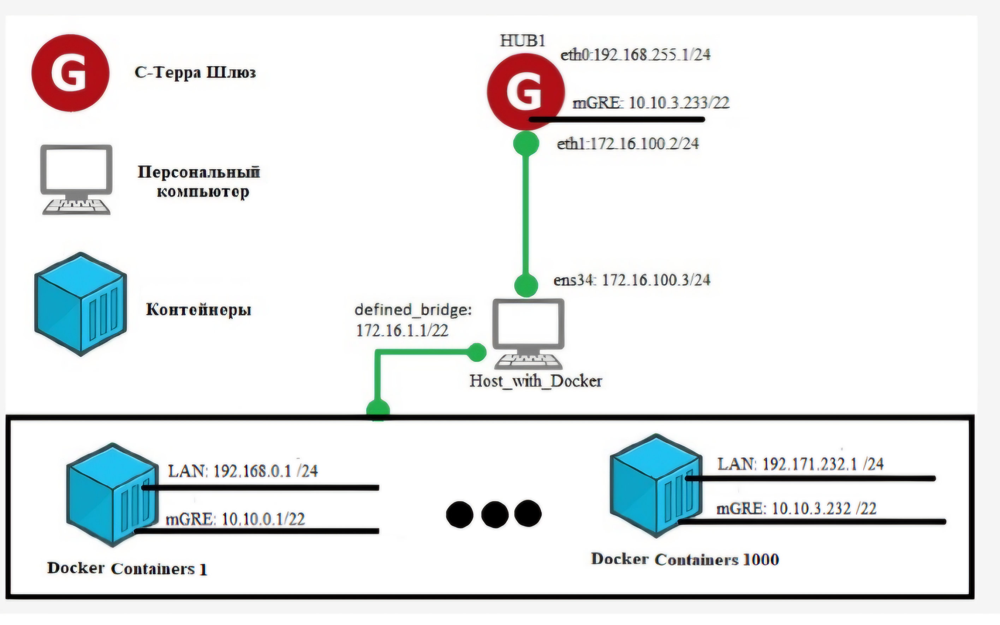

## Проект
Использование технологии контейнеризации при нагрузочном тестировании защищенного сетевого шлюза
## Цель
1. Провести тест на количество подключенных клиентов по защищенному каналу с использованием IPsec. Примерный план: подключить 1000 клиентов, развернутых в контейнерах Docker.
2. Шлюз будет использовать технологию DMVPN, которая используется для создания гибких и масштабируемых виртуальных частных сетей (VPN) с динамическим установлением туннелей по mGRE протоколу. Для этого на шлюзе будет развернут сервер NHRP. Аналогичные решения будет реализованы в контейнерах.
3. Для автоматизации создания образа и определения его конфигурации использовать Dockerfile.
4. Для контейнеров разобраться с особенностяит настройки сети. Разработать схему взаимодействия. 
5. Разработан сценарий автоматизации.
6. Провести нагрузочное тестирование.

В ходе работы будет разработа сеть из 1000 клиентов и одного шлюза в рамках технологии DMVPN. Контейры будут развернуты на одном Хосте, который будет подключен к Шлюзу непосредствено. Тестирование проводится с целью экономии ресурсов, так как разворот данного стенда в живую трудозатратно и дорого. 

Схема взаимодействия

